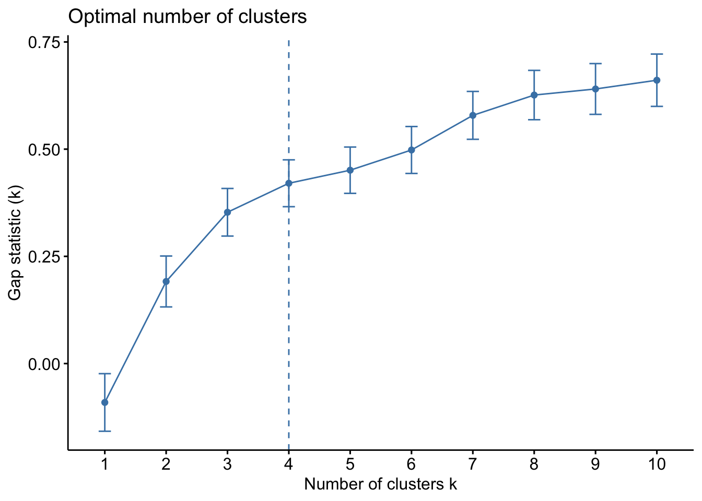
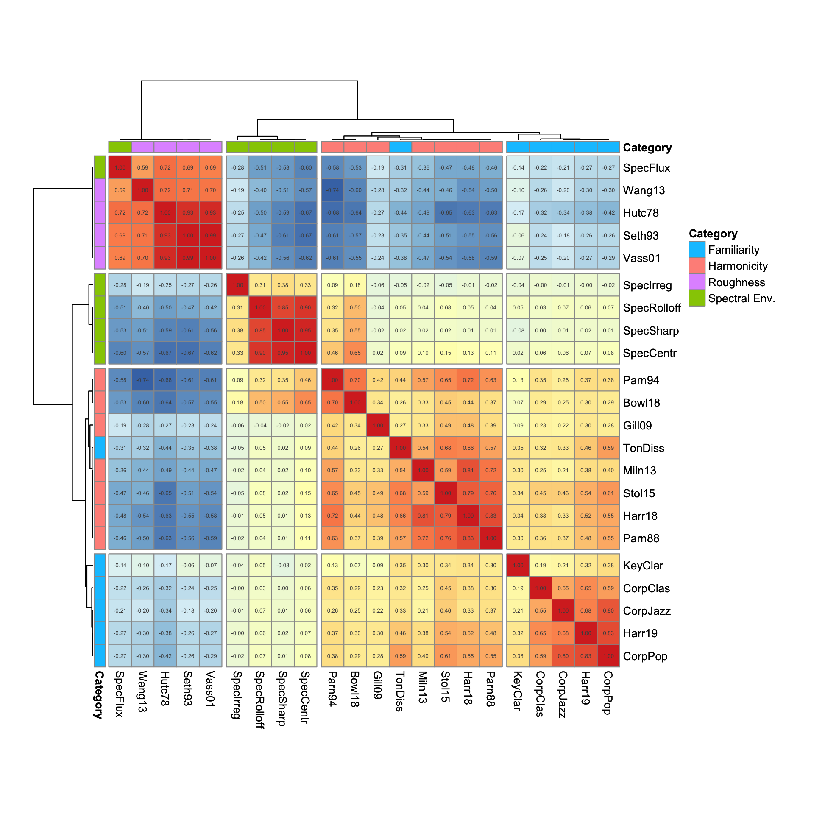
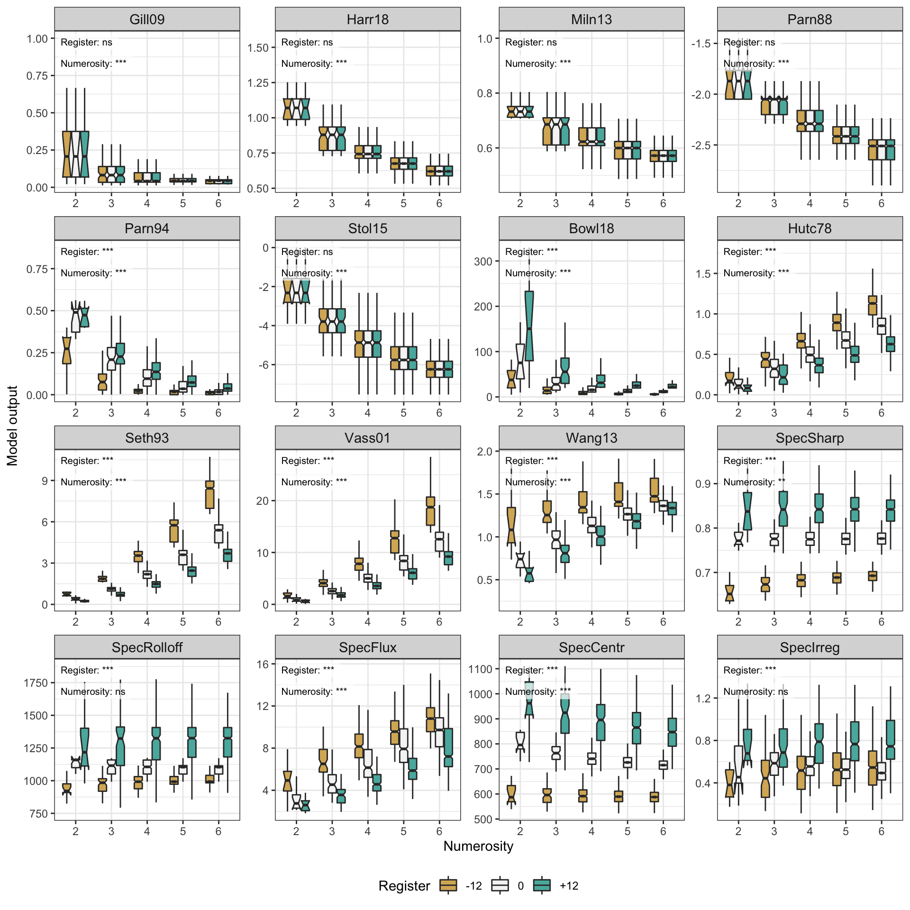
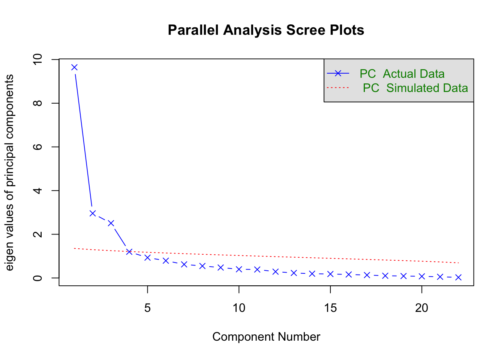

<!-- README.md is generated from README.Rmd. Please edit that file -->

# anatomy-of-consonance

<!-- badges: start -->
<!-- badges: end -->

This repository contains data and analyses related to study titled *The
Anatomy of Consonance/Dissonance: Evaluating Acoustic and Cultural
Predictors Across Multiple Datasets with Chords* by Tuomas Eerola and
Imre Lahdelma (Durham University, UK).

The study is organised into three experiments. Experiment 1 relates to
(Durham Chord Dataset)\[<https://github.com/tuomaseerola/DCD>\],
Experiment 2 to the analysis of three datasets, and Experiment 3 to the
analysis of nine datasets.

## Experiment 1

Full data of the Experiment 1 is available from
<https://github.com/tuomaseerola/DCD/>. the following scripts obtain the
data from that repository.

### Cluster analysis

``` r
corpus <- read.csv('https://raw.githubusercontent.com/tuomaseerola/DCD/master/data/DCD_predictors.csv')
print(dim(corpus))
#> [1] 4755   27
## Cluster analysis
library("factoextra")  # Load libraries
library("cluster")

## Prepare a correlation matrix
df <- cor(corpus[,6:dim(corpus)[2]], method = "pearson") # Eliminate first 5 columns (meta-data)
## Determine the number of clusters via hierarchical clustering
set.seed(123)
df.dist <- (1 - df)
gap_stat <- clusGap(df.dist,FUN = hcut, K.max = 10,B = 1000)
print(fviz_gap_stat(gap_stat, maxSE = list(method = "Tibs2001SEmax"))) # 4
```



### Visualise predictor correlations and clusters

``` r
library("pheatmap")

## Rename variables for clarity
rownames(df)[rownames(df)=='gill_09_harmonicity']<-"Gill09"
rownames(df)[rownames(df)=='stolz_15_periodicity']<-"Stol15"
rownames(df)[rownames(df)=='har_18_harmonicity']<-"Harr18"
rownames(df)[rownames(df)=='milne_13_harmonicity']<-"Miln13"
rownames(df)[rownames(df)=='parn_88_root_ambig']<-"Parn88"
rownames(df)[rownames(df)=='parn_94_complex']<-"Parn94"
rownames(df)[rownames(df)=='bowl_18_min_freq_dist']<-"Bowl18"
rownames(df)[rownames(df)=='hutch_78_roughness']<-"Hutc78"
rownames(df)[rownames(df)=='seth_93_roughness']<-"Seth93"
rownames(df)[rownames(df)=='vass_01_roughness']<-"Vass01"
rownames(df)[rownames(df)=='wang_13_roughness']<-"Wang13"
rownames(df)[rownames(df)=='har_19_corpus']<-"Harr19"
rownames(df)[rownames(df)=='neg_log_prob']<-"CorpPop"
rownames(df)[rownames(df)=='neg_log_prob_J']<-"CorpJazz"
rownames(df)[rownames(df)=='neg_log_prob_C']<-"CorpClas"
rownames(df)[rownames(df)=='sharpness']<-"SpecSharp"
rownames(df)[rownames(df)=='brightness']<-"SpecRolloff"
rownames(df)[rownames(df)=='spectralfluxSD']<-"SpecFlux"
rownames(df)[rownames(df)=='keyclarity']<-"KeyClar"
rownames(df)[rownames(df)=='spectralcentroid']<-"SpecCentr"
rownames(df)[rownames(df)=='irregularity']<-"SpecIrreg"
rownames(df)[rownames(df)=='TDL']<-"TonDiss"
colnames(df)<-rownames(df)

cat_df <- data.frame("Category" = c(
  rep("Harmonicity",7), 
  rep("Roughness",4),
  rep("Familiarity",1), 
  rep("Spectral Env.",5),
  rep("Familiarity",5))) 
rownames(cat_df) = colnames(df)

# Create plot
fig<-pheatmap(
  df,
  display_numbers = TRUE,
  fontsize_number=5,
 cutree_rows = 4,
 cutree_cols = 4,
  cluster_cols = TRUE,
  cluster_rows = TRUE,
  treeheight_row = 50,
  treeheight_col = 50,
  legend = FALSE,
  clustering_distance_cols = "correlation",
  clustering_distance_rows = "correlation",
  clustering_method = 'ward.D2', # was ward.D2
  annotation_col = cat_df,
  annotation_row = cat_df,
  annotation_legend = TRUE,
  annotation_names_col = TRUE,
  cellheight= 20, 
  cellwidth = 20
)
```

<div class="figure">


<p class="caption">
Figure 1. Correlations and a hierarchical cluster solution for
predictors of roughness, harmonicity, familiarity and spectral envelope
categories (Durham Chord Dataset, n = 4755).
</p>

</div>

### Visualise predictors across numerosity and register

``` r
names(corpus)[names(corpus)=='gill_09_harmonicity']<-"Gill09"
names(corpus)[names(corpus)=='har_18_harmonicity']<-"Harr18"
names(corpus)[names(corpus)=='milne_13_harmonicity']<-"Miln13"
names(corpus)[names(corpus)=='parn_88_root_ambig']<-"Parn88"
names(corpus)[names(corpus)=='parn_94_complex']<-"Parn94"
names(corpus)[names(corpus)=='stolz_15_periodicity']<-"Stol15"
names(corpus)[names(corpus)=='bowl_18_min_freq_dist']<-"Bowl18"
names(corpus)[names(corpus)=='hutch_78_roughness']<-"Hutc78"
names(corpus)[names(corpus)=='seth_93_roughness']<-"Seth93"
names(corpus)[names(corpus)=='vass_01_roughness']<-"Vass01"
names(corpus)[names(corpus)=='wang_13_roughness']<-"Wang13"
names(corpus)[names(corpus)=='har_19_corpus']<-"Harr19"
names(corpus)[names(corpus)=='neg_log_prob']<-"CorpPop"
names(corpus)[names(corpus)=='neg_log_prob_J']<-"CorpJazz"
names(corpus)[names(corpus)=='neg_log_prob_C']<-"CorpClas"
names(corpus)[names(corpus)=='sharpness']<-"SpecSharp"
names(corpus)[names(corpus)=='brightness']<-"SpecRolloff"
names(corpus)[names(corpus)=='spectralfluxSD']<-"SpecFlux"
names(corpus)[names(corpus)=='keyclarity']<-"KeyClar"
names(corpus)[names(corpus)=='spectralcentroid']<-"SpecCentr"
names(corpus)[names(corpus)=='irregularity']<-"SpecIrreg"
names(corpus)[names(corpus)=='TDL']<-"TonDiss"

#### 3. Run Anovas -------------------------
x<-matrix(NA,16,2) # pvalues
x[1,1:2]<-summary(aov(Gill09 ~ numtones * register, data=corpus))[[1]][1:2,5] 
x[2,1:2]<-summary(aov(Harr18 ~ numtones * register, data=corpus))[[1]][1:2,5]      
x[3,1:2]<-summary(aov(Miln13 ~ numtones * register, data=corpus))[[1]][1:2,5]      
x[4,1:2]<-summary(aov(Parn88 ~ numtones * register, data=corpus))[[1]][1:2,5]      
x[5,1:2]<-summary(aov(Parn94 ~ numtones * register, data=corpus))[[1]][1:2,5] 
x[6,1:2]<-summary(aov(Stol15 ~ numtones * register, data=corpus))[[1]][1:2,5] 
x[7,1:2]<-summary(aov(Bowl18 ~ numtones * register, data=corpus))[[1]][1:2,5] 
x[8,1:2]<-summary(aov(Hutc78 ~ numtones * register, data=corpus))[[1]][1:2,5] 
x[9,1:2]<-summary(aov(Seth93 ~ numtones * register, data=corpus))[[1]][1:2,5] 
x[10,1:2]<-summary(aov(Vass01 ~ numtones * register, data=corpus))[[1]][1:2,5]
x[11,1:2]<-summary(aov(Wang13 ~ numtones * register, data=corpus))[[1]][1:2,5]
x[12,1:2]<-summary(aov(SpecSharp ~ numtones * register, data=corpus))[[1]][1:2,5] 
x[13,1:2]<-summary(aov(SpecRolloff ~ numtones * register, data=corpus))[[1]][1:2,5]
x[14,1:2]<-summary(aov(SpecFlux ~ numtones * register, data=corpus))[[1]][1:2,5] 
x[15,1:2]<-summary(aov(SpecCentr ~ numtones * register, data=corpus))[[1]][1:2,5]
x[16,1:2]<-summary(aov(SpecIrreg ~ numtones * register, data=corpus))[[1]][1:2,5]

F<-matrix(NA,16,2) # F values
F[1,1:2]<-summary(aov(Gill09 ~ numtones * register, data=corpus))[[1]][1:2,4]
F[2,1:2]<-summary(aov(Harr18 ~ numtones * register, data=corpus))[[1]][1:2,4]
F[3,1:2]<-summary(aov(Miln13 ~ numtones * register, data=corpus))[[1]][1:2,4]
F[4,1:2]<-summary(aov(Parn88 ~ numtones * register, data=corpus))[[1]][1:2,4]
F[5,1:2]<-summary(aov(Parn94 ~ numtones * register, data=corpus))[[1]][1:2,4]
F[6,1:2]<-summary(aov(Stol15 ~ numtones * register, data=corpus))[[1]][1:2,4]
F[7,1:2]<-summary(aov(Bowl18 ~ numtones * register, data=corpus))[[1]][1:2,4]
F[8,1:2]<-summary(aov(Hutc78 ~ numtones * register, data=corpus))[[1]][1:2,4]
F[9,1:2]<-summary(aov(Seth93 ~ numtones * register, data=corpus))[[1]][1:2,4]
F[10,1:2]<-summary(aov(Vass01 ~ numtones * register, data=corpus))[[1]][1:2,4]
F[11,1:2]<-summary(aov(Wang13 ~ numtones * register, data=corpus))[[1]][1:2,4]
F[12,1:2]<-summary(aov(SpecSharp ~ numtones * register, data=corpus))[[1]][1:2,4]
F[13,1:2]<-summary(aov(SpecRolloff ~ numtones * register, data=corpus))[[1]][1:2,4]
F[14,1:2]<-summary(aov(SpecFlux ~ numtones * register, data=corpus))[[1]][1:2,4]
F[15,1:2]<-summary(aov(SpecCentr ~ numtones * register, data=corpus))[[1]][1:2,4]
F[16,1:2]<-summary(aov(SpecIrreg ~ numtones * register, data=corpus))[[1]][1:2,4]

#round(F,3) # 1 col for Numerosity, 2 col for register
varnames<-c("Gill09","Harr18","Miln13","Parn88","Parn94","Stol15","Bowl18","Hutc78","Seth93","Vass01","Wang13","SpecSharp","SpecRollof","SpecFlux","SpecCentr","SpecIrreg")
numerosity <- data.frame(Fval=F[,1], pval=x[,1])
rownames(numerosity)<-varnames
#print(round(numerosity,2))

register <- data.frame(Fval=F[,2], pval=x[,2])
rownames(register)<-varnames
#print(round(register,2))

#### Create long-form suitable for plotting  ---------------------
library(reshape2)
n<-names(corpus)
m <- melt(corpus,id.vars = c('numtones','register'),measure.vars = n[c(6:16,18:22)])
m$register<-factor(m$register,levels = c(-12,0,12),labels = c('-12','0','+12'))
m$numtones<-factor(m$numtones)

#### ADD p-values to plot: Register
R<-dplyr::summarise(dplyr::group_by(m,variable),YM= max(value)-(max(value)-min(value))*0.025)
R$pval<-c('ns','ns','ns','ns','***','ns','***','***','***','***','***','***','***','***','***','***')
R$XM<-c(3,3,3,3,3,3,3,3,3,3,3,3,3,3,3,3)-2.5

#### ADD p-values to plot: Numerosity
N<-dplyr::summarise(dplyr::group_by(m,variable),YM= max(value)-(max(value)-min(value))*0.17) # was 0.12
N$pval<-c('***','***','***','***','***','***','***','***','***','***','***','**','ns','***','***','ns')
N$XM<-c(3,3,3,3,3,3,3,3,3,3,3,3,3,3,3,3)-2.5

#### boxplot
library(ggplot2)
g2<-ggplot(m,aes(x=numtones,y=value,fill=register))+
  geom_boxplot(notch = TRUE,varwidth = FALSE,outlier.shape = NA,size=0.5)+
  scale_fill_brewer(name='Register',type = 'div')+
  facet_wrap(~variable,nrow = 4,ncol = 4,scales = 'free')+
  geom_label(data = R, aes(x = XM, y = YM, label = paste0("Register: ",pval)),inherit.aes = FALSE,size=2.70,hjust=0,alpha=0.70,label.size = 0)+
  geom_label(data = N, aes(x = XM, y = YM, label = paste0("Numerosity: ",pval)),inherit.aes = FALSE,size=2.70,hjust=0,alpha=0.70,label.size = 0)+
  xlab('Numerosity')+
  ylab('Model output')+
  theme_bw()+
  theme(legend.position="bottom")+
  theme(strip.text.x = element_text(size = 11))

print(g2)
```

<div class="figure">


<p class="caption">
Figure2. Numerosity and register across roughness and harmonicity models
(Durham Chord Dataset, n = 4755).
</p>

</div>

## Experiment 2

### Optimisation of the feature categories with LMM

``` r
#### 0. Load data and libraries -------------------------
df<-read.csv('data/experiment2_data.csv',header = TRUE)
library(lme4)
library(lmerTest)
library(MuMIn)
library(ppcor)
library(caret)

#### 1. Null model -------------------------
lmer.0 <- lmer(Rating ~ (1|chord_size) + (1|timbre) + (1|dataset) + (1|RandomID),data=df,control = lmerControl(optimizer="Nelder_Mead"))
summary(lmer.0, correlation = FALSE) #
#> Linear mixed model fit by REML. t-tests use Satterthwaite's method [
#> lmerModLmerTest]
#> Formula: Rating ~ (1 | chord_size) + (1 | timbre) + (1 | dataset) + (1 |  
#>     RandomID)
#>    Data: df
#> Control: lmerControl(optimizer = "Nelder_Mead")
#> 
#> REML criterion at convergence: 34473.2
#> 
#> Scaled residuals: 
#>      Min       1Q   Median       3Q      Max 
#> -2.79088 -0.74887 -0.02911  0.79613  2.71469 
#> 
#> Random effects:
#>  Groups     Name        Variance Std.Dev.
#>  RandomID   (Intercept) 0.144743 0.38045 
#>  chord_size (Intercept) 0.054158 0.23272 
#>  dataset    (Intercept) 0.049493 0.22247 
#>  timbre     (Intercept) 0.001462 0.03823 
#>  Residual               1.206633 1.09847 
#> Number of obs: 11260, groups:  
#> RandomID, 172; chord_size, 7; dataset, 3; timbre, 2
#> 
#> Fixed effects:
#>             Estimate Std. Error     df t value Pr(>|t|)    
#> (Intercept)   2.9364     0.1631 3.8024      18 8.04e-05 ***
#> ---
#> Signif. codes:  0 '***' 0.001 '**' 0.01 '*' 0.05 '.' 0.1 ' ' 1

rand(lmer.0)           #   TABLE 2
#> ANOVA-like table for random-effects: Single term deletions
#> 
#> Model:
#> Rating ~ (1 | chord_size) + (1 | timbre) + (1 | dataset) + (1 | RandomID)
#>                  npar logLik   AIC    LRT Df Pr(>Chisq)    
#> <none>              6 -17237 34485                         
#> (1 | chord_size)    5 -17338 34685 201.81  1  < 2.2e-16 ***
#> (1 | timbre)        5 -17237 34484   0.82  1   0.363987    
#> (1 | dataset)       5 -17242 34494  10.50  1   0.001195 ** 
#> (1 | RandomID)      5 -17685 35380 896.47  1  < 2.2e-16 ***
#> ---
#> Signif. codes:  0 '***' 0.001 '**' 0.01 '*' 0.05 '.' 0.1 ' ' 1
round(r.squaredGLMM(lmer.0),3) #  0 0.172                                  TABLE 2
#>      R2m   R2c
#> [1,]   0 0.172
round(AIC(lmer.0))    # 34485                                                TABLE 2
#> [1] 34485

#### 2. Harr20 model components --------
lmer.D23 <- update(lmer.0, . ~ . + har_18_harmonicity + har_19_corpus)
lmer.D <- update(lmer.0, . ~ . + hutch_78_roughness + har_18_harmonicity + har_19_corpus)
anova(lmer.D23,lmer.D,REML=FALSE,refit=FALSE,test="Wald") # chi^2=446.5 p <.001    TABLE 1
#> Data: df
#> Models:
#> lmer.D23: Rating ~ (1 | chord_size) + (1 | timbre) + (1 | dataset) + (1 | 
#> lmer.D23:     RandomID) + har_18_harmonicity + har_19_corpus
#> lmer.D: Rating ~ (1 | chord_size) + (1 | timbre) + (1 | dataset) + (1 | 
#> lmer.D:     RandomID) + hutch_78_roughness + har_18_harmonicity + har_19_corpus
#>          npar   AIC   BIC logLik deviance Chisq Df Pr(>Chisq)    
#> lmer.D23    8 32320 32379 -16152    32304                        
#> lmer.D      9 31876 31942 -15929    31858 446.5  1  < 2.2e-16 ***
#> ---
#> Signif. codes:  0 '***' 0.001 '**' 0.01 '*' 0.05 '.' 0.1 ' ' 1

lmer.D13 <- update(lmer.0, . ~ . + hutch_78_roughness + har_19_corpus)
anova(lmer.D13,lmer.D,REML=FALSE,refit=FALSE) # chi^2=2.2084, p=0.1373 TABLE 1
#> Data: df
#> Models:
#> lmer.D13: Rating ~ (1 | chord_size) + (1 | timbre) + (1 | dataset) + (1 | 
#> lmer.D13:     RandomID) + hutch_78_roughness + har_19_corpus
#> lmer.D: Rating ~ (1 | chord_size) + (1 | timbre) + (1 | dataset) + (1 | 
#> lmer.D:     RandomID) + hutch_78_roughness + har_18_harmonicity + har_19_corpus
#>          npar   AIC   BIC logLik deviance  Chisq Df Pr(>Chisq)
#> lmer.D13    8 31876 31935 -15930    31860                     
#> lmer.D      9 31876 31942 -15929    31858 2.2084  1     0.1373

lmer.D12 <- update(lmer.0, . ~ . + hutch_78_roughness + har_18_harmonicity)
anova(lmer.D12,lmer.D,REML=FALSE,refit=FALSE) # chi^2=509.39, p<.001   TABLE 1
#> Data: df
#> Models:
#> lmer.D12: Rating ~ (1 | chord_size) + (1 | timbre) + (1 | dataset) + (1 | 
#> lmer.D12:     RandomID) + hutch_78_roughness + har_18_harmonicity
#> lmer.D: Rating ~ (1 | chord_size) + (1 | timbre) + (1 | dataset) + (1 | 
#> lmer.D:     RandomID) + hutch_78_roughness + har_18_harmonicity + har_19_corpus
#>          npar   AIC   BIC logLik deviance  Chisq Df Pr(>Chisq)    
#> lmer.D12    8 32383 32442 -16184    32367                         
#> lmer.D      9 31876 31942 -15929    31858 509.39  1  < 2.2e-16 ***
#> ---
#> Signif. codes:  0 '***' 0.001 '**' 0.01 '*' 0.05 '.' 0.1 ' ' 1

#### 2. Harr20 model -------------------------
lmer.RHF <- update(lmer.0, . ~ . + hutch_78_roughness + har_18_harmonicity + har_19_corpus)
summary(lmer.RHF, correlation = FALSE) #
#> Linear mixed model fit by REML. t-tests use Satterthwaite's method [
#> lmerModLmerTest]
#> Formula: Rating ~ (1 | chord_size) + (1 | timbre) + (1 | dataset) + (1 |  
#>     RandomID) + hutch_78_roughness + har_18_harmonicity + har_19_corpus
#>    Data: df
#> Control: lmerControl(optimizer = "Nelder_Mead")
#> 
#> REML criterion at convergence: 31857.9
#> 
#> Scaled residuals: 
#>     Min      1Q  Median      3Q     Max 
#> -3.7069 -0.6922 -0.0373  0.7253  3.1626 
#> 
#> Random effects:
#>  Groups     Name        Variance Std.Dev.
#>  RandomID   (Intercept) 0.148637 0.38554 
#>  chord_size (Intercept) 0.060906 0.24679 
#>  dataset    (Intercept) 0.085102 0.29172 
#>  timbre     (Intercept) 0.001597 0.03997 
#>  Residual               0.951785 0.97559 
#> Number of obs: 11260, groups:  
#> RandomID, 172; chord_size, 7; dataset, 3; timbre, 2
#> 
#> Fixed effects:
#>                      Estimate Std. Error         df t value Pr(>|t|)    
#> (Intercept)         4.402e+00  2.293e-01  5.677e+00   19.20 2.21e-06 ***
#> hutch_78_roughness -2.143e+00  9.961e-02  9.832e+03  -21.52  < 2e-16 ***
#> har_18_harmonicity  2.187e-01  9.721e-02  1.007e+04    2.25   0.0245 *  
#> har_19_corpus      -1.054e-01  4.542e-03  9.146e+03  -23.20  < 2e-16 ***
#> ---
#> Signif. codes:  0 '***' 0.001 '**' 0.01 '*' 0.05 '.' 0.1 ' ' 1
s<-summary(lmer.RHF, correlation = FALSE) #
round(s$coefficients[,1],2)                    # TABLE 2  c 4.40  -R 2.14  H 0.22  F -0.11 
#>        (Intercept) hutch_78_roughness har_18_harmonicity      har_19_corpus 
#>               4.40              -2.14               0.22              -0.11
#round(confint(lmer.RHF),2)                     # TABLE 2 c3.96   4.88 R -2.34  -1.94 H 0.03   0.41 F -0.11  -0.10
# (Intercept)         3.92   4.88
# hutch_78_roughness -2.34  -1.94
# har_18_harmonicity  0.03   0.41
# har_19_corpus      -0.11  -0.10

rand(lmer.RHF)                                 # TABLE 2
#> ANOVA-like table for random-effects: Single term deletions
#> 
#> Model:
#> Rating ~ hutch_78_roughness + har_18_harmonicity + har_19_corpus + (1 | chord_size) + (1 | timbre) + (1 | dataset) + (1 | RandomID)
#>                  npar logLik   AIC     LRT Df Pr(>Chisq)    
#> <none>              9 -15929 31876                          
#> (1 | chord_size)    8 -15962 31940   65.97  1  4.576e-16 ***
#> (1 | timbre)        8 -15930 31875    1.32  1     0.2513    
#> (1 | dataset)       8 -15943 31903   28.66  1  8.612e-08 ***
#> (1 | RandomID)      8 -16534 33085 1210.88  1  < 2.2e-16 ***
#> ---
#> Signif. codes:  0 '***' 0.001 '**' 0.01 '*' 0.05 '.' 0.1 ' ' 1
round(r.squaredGLMM(lmer.RHF),3) # 0.21 0.397 # TABLE 2
#>       R2m   R2c
#> [1,] 0.21 0.397
round(AIC(lmer.RHF))  # 31876                  # TABLE 2
#> [1] 31876
# semipartial correlations
print(spcor.test(df$Rating,df$hutch_78_roughness,df[,c("har_18_harmonicity","har_19_corpus")]))   # -0.141   TABLE 1
#>     estimate      p.value statistic     n gp  Method
#> 1 -0.1409804 4.530493e-51 -15.10811 11260  2 pearson
print(spcor.test(df$Rating,df$har_18_harmonicity,df[,c("hutch_78_roughness","har_19_corpus")]))   # -0.047   TABLE 1
#>     estimate      p.value statistic     n gp  Method
#> 1 0.04706114 5.866062e-07  4.998457 11260  2 pearson
print(spcor.test(df$Rating,df$har_19_corpus,df[,c("hutch_78_roughness","har_18_harmonicity")]))   # -0.216   TABLE 1
#>     estimate       p.value statistic     n gp  Method
#> 1 -0.2163562 2.303585e-119 -23.51103 11260  2 pearson

#### 3. Optimise feature categories -------------------------

#### 3 A Replace ROUGHNESS hutch_78_roughness ---------------- 
lmer.R1 <- update(lmer.0, . ~ . + seth_93_roughness + har_18_harmonicity + har_19_corpus)
lmer.R2 <- update(lmer.0, . ~ . + vass_01_roughness + har_18_harmonicity + har_19_corpus)
lmer.R3 <- update(lmer.0, . ~ . + wang_13_roughness + har_18_harmonicity + har_19_corpus)
lmer.R4 <- update(lmer.0, . ~ . + spflux + har_18_harmonicity + har_19_corpus)

anova(lmer.RHF,lmer.R1,REML=FALSE,refit=FALSE) # chi^2=0
#> Data: df
#> Models:
#> lmer.RHF: Rating ~ (1 | chord_size) + (1 | timbre) + (1 | dataset) + (1 | 
#> lmer.RHF:     RandomID) + hutch_78_roughness + har_18_harmonicity + har_19_corpus
#> lmer.R1: Rating ~ (1 | chord_size) + (1 | timbre) + (1 | dataset) + (1 | 
#> lmer.R1:     RandomID) + seth_93_roughness + har_18_harmonicity + har_19_corpus
#>          npar   AIC   BIC logLik deviance Chisq Df Pr(>Chisq)
#> lmer.RHF    9 31876 31942 -15929    31858                    
#> lmer.R1     9 32271 32337 -16127    32253     0  0
anova(lmer.RHF,lmer.R2,REML=FALSE,refit=FALSE) # chi^2=0
#> Data: df
#> Models:
#> lmer.RHF: Rating ~ (1 | chord_size) + (1 | timbre) + (1 | dataset) + (1 | 
#> lmer.RHF:     RandomID) + hutch_78_roughness + har_18_harmonicity + har_19_corpus
#> lmer.R2: Rating ~ (1 | chord_size) + (1 | timbre) + (1 | dataset) + (1 | 
#> lmer.R2:     RandomID) + vass_01_roughness + har_18_harmonicity + har_19_corpus
#>          npar   AIC   BIC logLik deviance Chisq Df Pr(>Chisq)
#> lmer.RHF    9 31876 31942 -15929    31858                    
#> lmer.R2     9 32275 32341 -16129    32257     0  0
anova(lmer.RHF,lmer.R3,REML=FALSE,refit=FALSE) # chi^2=0
#> Data: df
#> Models:
#> lmer.RHF: Rating ~ (1 | chord_size) + (1 | timbre) + (1 | dataset) + (1 | 
#> lmer.RHF:     RandomID) + hutch_78_roughness + har_18_harmonicity + har_19_corpus
#> lmer.R3: Rating ~ (1 | chord_size) + (1 | timbre) + (1 | dataset) + (1 | 
#> lmer.R3:     RandomID) + wang_13_roughness + har_18_harmonicity + har_19_corpus
#>          npar   AIC   BIC logLik deviance Chisq Df Pr(>Chisq)
#> lmer.RHF    9 31876 31942 -15929    31858                    
#> lmer.R3     9 32213 32279 -16098    32195     0  0
anova(lmer.RHF,lmer.R4,REML=FALSE,refit=FALSE) # chi^2=0
#> Data: df
#> Models:
#> lmer.RHF: Rating ~ (1 | chord_size) + (1 | timbre) + (1 | dataset) + (1 | 
#> lmer.RHF:     RandomID) + hutch_78_roughness + har_18_harmonicity + har_19_corpus
#> lmer.R4: Rating ~ (1 | chord_size) + (1 | timbre) + (1 | dataset) + (1 | 
#> lmer.R4:     RandomID) + spflux + har_18_harmonicity + har_19_corpus
#>          npar   AIC   BIC logLik deviance Chisq Df Pr(>Chisq)
#> lmer.RHF    9 31876 31942 -15929    31858                    
#> lmer.R4     9 32247 32313 -16115    32229     0  0

print(spcor.test(df$Rating,df$seth_93_roughness,df[,c("har_18_harmonicity","har_19_corpus")]))   # -0.051   TABLE 1
#>      estimate      p.value statistic     n gp  Method
#> 1 -0.05100523 6.136817e-08 -5.418417 11260  2 pearson
print(spcor.test(df$Rating,df$vass_01_roughness,df[,c("har_18_harmonicity","har_19_corpus")]))   # -0.047  TABLE 1
#>      estimate      p.value statistic     n gp  Method
#> 1 -0.04686852 6.521177e-07 -4.977953 11260  2 pearson
print(spcor.test(df$Rating,df$wang_13_roughness,df[,c("har_18_harmonicity","har_19_corpus")]))   # -0.075  TABLE 1
#>      estimate      p.value statistic     n gp  Method
#> 1 -0.07542064 1.120016e-15 -8.024556 11260  2 pearson
print(spcor.test(df$Rating,df$spflux,df[,c("har_18_harmonicity","har_19_corpus")]))              # -0.060  TABLE 1
#>      estimate      p.value statistic     n gp  Method
#> 1 -0.06041776 1.401787e-10 -6.421711 11260  2 pearson

#### 3 B. Replace HARMONICITY har_18_harmonicity ------------------
lmer.H1 <- update(lmer.0, . ~ . + hutch_78_roughness + milne_13_harmonicity + har_19_corpus)
lmer.H2 <- update(lmer.0, . ~ . + hutch_78_roughness + parn_88_root_ambig + har_19_corpus)
lmer.H3 <- update(lmer.0, . ~ . + hutch_78_roughness + parn_94_complex + har_19_corpus)
lmer.H4 <- update(lmer.0, . ~ . + hutch_78_roughness + bowl_18_min_freq_dist + har_19_corpus)
lmer.H5 <- update(lmer.0, . ~ . + hutch_78_roughness + TDL + har_19_corpus)
lmer.H6 <- update(lmer.0, . ~ . + hutch_78_roughness + stolz_15_periodicity + har_19_corpus)
lmer.H7 <- update(lmer.0, . ~ . + hutch_78_roughness + gill_09_harmonicity + har_19_corpus)

anova(lmer.RHF,lmer.H1,REML=FALSE,refit=FALSE) #            TABLE 1
#> Data: df
#> Models:
#> lmer.RHF: Rating ~ (1 | chord_size) + (1 | timbre) + (1 | dataset) + (1 | 
#> lmer.RHF:     RandomID) + hutch_78_roughness + har_18_harmonicity + har_19_corpus
#> lmer.H1: Rating ~ (1 | chord_size) + (1 | timbre) + (1 | dataset) + (1 | 
#> lmer.H1:     RandomID) + hutch_78_roughness + milne_13_harmonicity + har_19_corpus
#>          npar   AIC   BIC logLik deviance Chisq Df Pr(>Chisq)
#> lmer.RHF    9 31876 31942 -15929    31858                    
#> lmer.H1     9 31879 31945 -15931    31861     0  0
anova(lmer.RHF,lmer.H2,REML=FALSE,refit=FALSE) # 18.437     TABLE 1
#> Data: df
#> Models:
#> lmer.RHF: Rating ~ (1 | chord_size) + (1 | timbre) + (1 | dataset) + (1 | 
#> lmer.RHF:     RandomID) + hutch_78_roughness + har_18_harmonicity + har_19_corpus
#> lmer.H2: Rating ~ (1 | chord_size) + (1 | timbre) + (1 | dataset) + (1 | 
#> lmer.H2:     RandomID) + hutch_78_roughness + parn_88_root_ambig + har_19_corpus
#>          npar   AIC   BIC logLik deviance  Chisq Df Pr(>Chisq)
#> lmer.RHF    9 31876 31942 -15929    31858                     
#> lmer.H2     9 31857 31923 -15920    31839 18.437  0
anova(lmer.RHF,lmer.H3,REML=FALSE,refit=FALSE) #            TABLE 1
#> Data: df
#> Models:
#> lmer.RHF: Rating ~ (1 | chord_size) + (1 | timbre) + (1 | dataset) + (1 | 
#> lmer.RHF:     RandomID) + hutch_78_roughness + har_18_harmonicity + har_19_corpus
#> lmer.H3: Rating ~ (1 | chord_size) + (1 | timbre) + (1 | dataset) + (1 | 
#> lmer.H3:     RandomID) + hutch_78_roughness + parn_94_complex + har_19_corpus
#>          npar   AIC   BIC logLik deviance Chisq Df Pr(>Chisq)
#> lmer.RHF    9 31876 31942 -15929    31858                    
#> lmer.H3     9 31878 31944 -15930    31860     0  0
anova(lmer.RHF,lmer.H4,REML=FALSE,refit=FALSE) # 72.502     TABLE 1
#> Data: df
#> Models:
#> lmer.RHF: Rating ~ (1 | chord_size) + (1 | timbre) + (1 | dataset) + (1 | 
#> lmer.RHF:     RandomID) + hutch_78_roughness + har_18_harmonicity + har_19_corpus
#> lmer.H4: Rating ~ (1 | chord_size) + (1 | timbre) + (1 | dataset) + (1 | 
#> lmer.H4:     RandomID) + hutch_78_roughness + bowl_18_min_freq_dist + 
#> lmer.H4:     har_19_corpus
#>          npar   AIC   BIC logLik deviance  Chisq Df Pr(>Chisq)
#> lmer.RHF    9 31876 31942 -15929    31858                     
#> lmer.H4     9 31803 31869 -15893    31785 72.502  0
anova(lmer.RHF,lmer.H5,REML=FALSE,refit=FALSE) # 124.33     TABLE 1
#> Data: df
#> Models:
#> lmer.RHF: Rating ~ (1 | chord_size) + (1 | timbre) + (1 | dataset) + (1 | 
#> lmer.RHF:     RandomID) + hutch_78_roughness + har_18_harmonicity + har_19_corpus
#> lmer.H5: Rating ~ (1 | chord_size) + (1 | timbre) + (1 | dataset) + (1 | 
#> lmer.H5:     RandomID) + hutch_78_roughness + TDL + har_19_corpus
#>          npar   AIC   BIC logLik deviance  Chisq Df Pr(>Chisq)
#> lmer.RHF    9 31876 31942 -15929    31858                     
#> lmer.H5     9 31752 31818 -15867    31734 124.33  0
anova(lmer.RHF,lmer.H6,REML=FALSE,refit=FALSE) # 148.76     TABLE 1
#> Data: df
#> Models:
#> lmer.RHF: Rating ~ (1 | chord_size) + (1 | timbre) + (1 | dataset) + (1 | 
#> lmer.RHF:     RandomID) + hutch_78_roughness + har_18_harmonicity + har_19_corpus
#> lmer.H6: Rating ~ (1 | chord_size) + (1 | timbre) + (1 | dataset) + (1 | 
#> lmer.H6:     RandomID) + hutch_78_roughness + stolz_15_periodicity + har_19_corpus
#>          npar   AIC   BIC logLik deviance  Chisq Df Pr(>Chisq)
#> lmer.RHF    9 31876 31942 -15929    31858                     
#> lmer.H6     9 31727 31793 -15855    31709 148.76  0
anova(lmer.RHF,lmer.H7,REML=FALSE,refit=FALSE) # 7.7232     TABLE 1
#> Data: df
#> Models:
#> lmer.RHF: Rating ~ (1 | chord_size) + (1 | timbre) + (1 | dataset) + (1 | 
#> lmer.RHF:     RandomID) + hutch_78_roughness + har_18_harmonicity + har_19_corpus
#> lmer.H7: Rating ~ (1 | chord_size) + (1 | timbre) + (1 | dataset) + (1 | 
#> lmer.H7:     RandomID) + hutch_78_roughness + gill_09_harmonicity + har_19_corpus
#>          npar   AIC   BIC logLik deviance  Chisq Df Pr(>Chisq)
#> lmer.RHF    9 31876 31942 -15929    31858                     
#> lmer.H7     9 31868 31934 -15925    31850 7.7232  0

print(spcor.test(df$Rating,df$milne_13_harmonicity,df[,c("hutch_78_roughness","har_19_corpus")]))  #  0.034 TABLE 1
#>     estimate      p.value statistic     n gp  Method
#> 1 0.03441373 0.0002601035  3.653264 11260  2 pearson
print(spcor.test(df$Rating,df$parn_88_root_ambig,df[,c("hutch_78_roughness","har_19_corpus")]))    # -0.058  TABLE 1
#>     estimate      p.value statistic     n gp  Method
#> 1 -0.0575736 9.767384e-10 -6.118379 11260  2 pearson
print(spcor.test(df$Rating,df$parn_94_complex,df[,c("hutch_78_roughness","har_19_corpus")]))       # 0.001  TABLE 1
#>      estimate   p.value statistic     n gp  Method
#> 1 0.006054945 0.5206221  0.642407 11260  2 pearson
print(spcor.test(df$Rating,df$bowl_18_min_freq_dist,df[,c("hutch_78_roughness","har_19_corpus")])) # -0.050  TABLE 1
#>      estimate      p.value statistic     n gp  Method
#> 1 -0.05033098 9.137137e-08 -5.346607 11260  2 pearson
print(spcor.test(df$Rating,df$TDL,df[,c("hutch_78_roughness","har_19_corpus")]))                   # 0.087  TABLE 1
#>     estimate      p.value statistic     n gp  Method
#> 1 0.08720978 1.862861e-20  9.287847 11260  2 pearson
print(spcor.test(df$Rating,df$stolz_15_periodicity,df[,c("hutch_78_roughness","har_19_corpus")]))  # 0.108  TABLE 1
#>    estimate     p.value statistic     n gp  Method
#> 1 0.1080779 1.32085e-30  11.53401 11260  2 pearson
print(spcor.test(df$Rating,df$gill_09_harmonicity,df[,c("hutch_78_roughness","har_19_corpus")]))   # 0.037  TABLE 1
#>    estimate      p.value statistic     n gp  Method
#> 1 0.0371497 8.058812e-05  3.944094 11260  2 pearson

#### 3 C Replace FAMILIARY har_19_corpus -----------------
lmer.F1 <- update(lmer.0, . ~ . + hutch_78_roughness + stolz_15_periodicity + keyclar)
lmer.F2 <- update(lmer.0, . ~ . + hutch_78_roughness + stolz_15_periodicity + CorpPop)
lmer.F3 <- update(lmer.0, . ~ . + hutch_78_roughness + stolz_15_periodicity + CorpJazz)
lmer.F4 <- update(lmer.0, . ~ . + hutch_78_roughness + stolz_15_periodicity + CorpClas)

anova(lmer.H6,lmer.F1,REML=FALSE,refit=FALSE)   #           TABLE 1
#> Data: df
#> Models:
#> lmer.H6: Rating ~ (1 | chord_size) + (1 | timbre) + (1 | dataset) + (1 | 
#> lmer.H6:     RandomID) + hutch_78_roughness + stolz_15_periodicity + har_19_corpus
#> lmer.F1: Rating ~ (1 | chord_size) + (1 | timbre) + (1 | dataset) + (1 | 
#> lmer.F1:     RandomID) + hutch_78_roughness + stolz_15_periodicity + keyclar
#>         npar   AIC   BIC logLik deviance Chisq Df Pr(>Chisq)
#> lmer.H6    9 31727 31793 -15855    31709                    
#> lmer.F1    9 31917 31983 -15950    31899     0  0
anova(lmer.H6,lmer.F2,REML=FALSE,refit=FALSE)   # 305.15    TABLE 1
#> Data: df
#> Models:
#> lmer.H6: Rating ~ (1 | chord_size) + (1 | timbre) + (1 | dataset) + (1 | 
#> lmer.H6:     RandomID) + hutch_78_roughness + stolz_15_periodicity + har_19_corpus
#> lmer.F2: Rating ~ (1 | chord_size) + (1 | timbre) + (1 | dataset) + (1 | 
#> lmer.F2:     RandomID) + hutch_78_roughness + stolz_15_periodicity + CorpPop
#>         npar   AIC   BIC logLik deviance  Chisq Df Pr(>Chisq)
#> lmer.H6    9 31727 31793 -15855    31709                     
#> lmer.F2    9 31422 31488 -15702    31404 305.15  0
anova(lmer.H6,lmer.F3,REML=FALSE,refit=FALSE)   # 0         TABLE 1
#> Data: df
#> Models:
#> lmer.H6: Rating ~ (1 | chord_size) + (1 | timbre) + (1 | dataset) + (1 | 
#> lmer.H6:     RandomID) + hutch_78_roughness + stolz_15_periodicity + har_19_corpus
#> lmer.F3: Rating ~ (1 | chord_size) + (1 | timbre) + (1 | dataset) + (1 | 
#> lmer.F3:     RandomID) + hutch_78_roughness + stolz_15_periodicity + CorpJazz
#>         npar   AIC   BIC logLik deviance Chisq Df Pr(>Chisq)
#> lmer.H6    9 31727 31793 -15855    31709                    
#> lmer.F3    9 31804 31870 -15893    31786     0  0
anova(lmer.H6,lmer.F4,REML=FALSE,refit=FALSE)   # 0         TABLE 1
#> Data: df
#> Models:
#> lmer.H6: Rating ~ (1 | chord_size) + (1 | timbre) + (1 | dataset) + (1 | 
#> lmer.H6:     RandomID) + hutch_78_roughness + stolz_15_periodicity + har_19_corpus
#> lmer.F4: Rating ~ (1 | chord_size) + (1 | timbre) + (1 | dataset) + (1 | 
#> lmer.F4:     RandomID) + hutch_78_roughness + stolz_15_periodicity + CorpClas
#>         npar   AIC   BIC logLik deviance Chisq Df Pr(>Chisq)
#> lmer.H6    9 31727 31793 -15855    31709                    
#> lmer.F4    9 31931 31997 -15956    31913     0  0

print(spcor.test(df$Rating,df$keyclar,df[,c("hutch_78_roughness","stolz_15_periodicity")]))    #  0.131 TABLE 1
#>    estimate     p.value statistic     n gp  Method
#> 1 0.1306269 4.91605e-44  13.97854 11260  2 pearson
print(spcor.test(df$Rating,df$CorpPop,df[,c("hutch_78_roughness","stolz_15_periodicity")]))    # -0.228 TABLE 1
#>     estimate       p.value statistic     n gp  Method
#> 1 -0.2281692 6.868565e-133 -24.86331 11260  2 pearson
print(spcor.test(df$Rating,df$CorpJazz,df[,c("hutch_78_roughness","stolz_15_periodicity")]))   # -0.147 TABLE 1
#>     estimate      p.value statistic     n gp  Method
#> 1 -0.1473152 1.198251e-55 -15.80171 11260  2 pearson
print(spcor.test(df$Rating,df$CorpClas,df[,c("hutch_78_roughness","stolz_15_periodicity")]))   # -0.086 TABLE 1
#>      estimate      p.value statistic     n gp  Method
#> 1 -0.08584765 7.200688e-20 -9.141695 11260  2 pearson

#### 3 D. Replace SPECTRAL spcentr -------------------------

lmer.S1 <- update(lmer.0, . ~ . + hutch_78_roughness + stolz_15_periodicity + CorpPop + spcentr)
lmer.S2 <- update(lmer.0, . ~ . + hutch_78_roughness + stolz_15_periodicity + CorpPop + sharpness)
lmer.S3 <- update(lmer.0, . ~ . + hutch_78_roughness + stolz_15_periodicity + CorpPop + spirreg)
lmer.S4 <- update(lmer.0, . ~ . + hutch_78_roughness + stolz_15_periodicity + CorpPop + sproll)

anova(lmer.F2,lmer.S1,REML=FALSE,refit=FALSE)  # 0               TABLE 1
#> Data: df
#> Models:
#> lmer.F2: Rating ~ (1 | chord_size) + (1 | timbre) + (1 | dataset) + (1 | 
#> lmer.F2:     RandomID) + hutch_78_roughness + stolz_15_periodicity + CorpPop
#> lmer.S1: Rating ~ (1 | chord_size) + (1 | timbre) + (1 | dataset) + (1 | 
#> lmer.S1:     RandomID) + hutch_78_roughness + stolz_15_periodicity + CorpPop + 
#> lmer.S1:     spcentr
#>         npar   AIC   BIC logLik deviance Chisq Df Pr(>Chisq)
#> lmer.F2    9 31422 31488 -15702    31404                    
#> lmer.S1   10 31424 31498 -15702    31404     0  1          1
anova(lmer.F2,lmer.S2,REML=FALSE,refit=FALSE)  # 0.6965 p=0.404  TABLE 1
#> Data: df
#> Models:
#> lmer.F2: Rating ~ (1 | chord_size) + (1 | timbre) + (1 | dataset) + (1 | 
#> lmer.F2:     RandomID) + hutch_78_roughness + stolz_15_periodicity + CorpPop
#> lmer.S2: Rating ~ (1 | chord_size) + (1 | timbre) + (1 | dataset) + (1 | 
#> lmer.S2:     RandomID) + hutch_78_roughness + stolz_15_periodicity + CorpPop + 
#> lmer.S2:     sharpness
#>         npar   AIC   BIC logLik deviance  Chisq Df Pr(>Chisq)
#> lmer.F2    9 31422 31488 -15702    31404                     
#> lmer.S2   10 31423 31497 -15702    31403 0.6965  1      0.404
anova(lmer.F2,lmer.S3,REML=FALSE,refit=FALSE)  # 16.838, ***    TABLE 1
#> Data: df
#> Models:
#> lmer.F2: Rating ~ (1 | chord_size) + (1 | timbre) + (1 | dataset) + (1 | 
#> lmer.F2:     RandomID) + hutch_78_roughness + stolz_15_periodicity + CorpPop
#> lmer.S3: Rating ~ (1 | chord_size) + (1 | timbre) + (1 | dataset) + (1 | 
#> lmer.S3:     RandomID) + hutch_78_roughness + stolz_15_periodicity + CorpPop + 
#> lmer.S3:     spirreg
#>         npar   AIC   BIC logLik deviance  Chisq Df Pr(>Chisq)    
#> lmer.F2    9 31422 31488 -15702    31404                         
#> lmer.S3   10 31407 31480 -15694    31387 16.838  1  4.071e-05 ***
#> ---
#> Signif. codes:  0 '***' 0.001 '**' 0.01 '*' 0.05 '.' 0.1 ' ' 1
anova(lmer.F2,lmer.S4,REML=FALSE,refit=FALSE)  # 0             TABLE 1
#> Data: df
#> Models:
#> lmer.F2: Rating ~ (1 | chord_size) + (1 | timbre) + (1 | dataset) + (1 | 
#> lmer.F2:     RandomID) + hutch_78_roughness + stolz_15_periodicity + CorpPop
#> lmer.S4: Rating ~ (1 | chord_size) + (1 | timbre) + (1 | dataset) + (1 | 
#> lmer.S4:     RandomID) + hutch_78_roughness + stolz_15_periodicity + CorpPop + 
#> lmer.S4:     sproll
#>         npar   AIC   BIC logLik deviance Chisq Df Pr(>Chisq)
#> lmer.F2    9 31422 31488 -15702    31404                    
#> lmer.S4   10 31440 31514 -15710    31420     0  1          1

print(spcor.test(df$Rating,df$spcentr,df[,c("hutch_78_roughness","stolz_15_periodicity","CorpPop")]))   # -0.0071  TABLE 1
#>       estimate   p.value  statistic     n gp  Method
#> 1 -0.007121494 0.4499436 -0.7555355 11260  3 pearson
print(spcor.test(df$Rating,df$sharpness,df[,c("hutch_78_roughness","stolz_15_periodicity","CorpPop")])) # -0.011  TABLE 1
#>      estimate   p.value statistic     n gp  Method
#> 1 -0.01173995 0.2129474 -1.245572 11260  3 pearson
print(spcor.test(df$Rating,df$spirreg,df[,c("hutch_78_roughness","stolz_15_periodicity","CorpPop")]))   # -0.047  TABLE 1
#>      estimate      p.value statistic     n gp  Method
#> 1 -0.04704231 5.934022e-07  -4.99623 11260  3 pearson
print(spcor.test(df$Rating,df$sproll,df[,c("hutch_78_roughness","stolz_15_periodicity","CorpPop")]))    # -0.02077  TABLE 1
#>      estimate    p.value statistic     n gp  Method
#> 1 -0.02077111 0.02753929 -2.204074 11260  3 pearson

#### 4. Harr20 Composite model -------------------

lmer.HP <- update(lmer.0, . ~ . + har_19_composite)
summary(lmer.HP,correlation=FALSE)
#> Linear mixed model fit by REML. t-tests use Satterthwaite's method [
#> lmerModLmerTest]
#> Formula: Rating ~ (1 | chord_size) + (1 | timbre) + (1 | dataset) + (1 |  
#>     RandomID) + har_19_composite
#>    Data: df
#> Control: lmerControl(optimizer = "Nelder_Mead")
#> 
#> REML criterion at convergence: 32042.8
#> 
#> Scaled residuals: 
#>     Min      1Q  Median      3Q     Max 
#> -3.9799 -0.6824 -0.0370  0.7111  3.0412 
#> 
#> Random effects:
#>  Groups     Name        Variance Std.Dev.
#>  RandomID   (Intercept) 0.148388 0.38521 
#>  chord_size (Intercept) 0.089999 0.30000 
#>  dataset    (Intercept) 0.051028 0.22589 
#>  timbre     (Intercept) 0.001539 0.03924 
#>  Residual               0.968285 0.98401 
#> Number of obs: 11260, groups:  
#> RandomID, 172; chord_size, 7; dataset, 3; timbre, 2
#> 
#> Fixed effects:
#>                   Estimate Std. Error        df t value Pr(>|t|)    
#> (Intercept)      2.275e+00  1.799e-01 4.752e+00   12.64 7.71e-05 ***
#> har_19_composite 8.511e-01  1.630e-02 1.083e+04   52.22  < 2e-16 ***
#> ---
#> Signif. codes:  0 '***' 0.001 '**' 0.01 '*' 0.05 '.' 0.1 ' ' 1
round(r.squaredGLMM(lmer.HP),3) # 0.221 0.401
#>        R2m   R2c
#> [1,] 0.221 0.401

#### TABLE 2 ---------------------
# null model
summary(lmer.0,  correlation = FALSE)
#> Linear mixed model fit by REML. t-tests use Satterthwaite's method [
#> lmerModLmerTest]
#> Formula: Rating ~ (1 | chord_size) + (1 | timbre) + (1 | dataset) + (1 |  
#>     RandomID)
#>    Data: df
#> Control: lmerControl(optimizer = "Nelder_Mead")
#> 
#> REML criterion at convergence: 34473.2
#> 
#> Scaled residuals: 
#>      Min       1Q   Median       3Q      Max 
#> -2.79088 -0.74887 -0.02911  0.79613  2.71469 
#> 
#> Random effects:
#>  Groups     Name        Variance Std.Dev.
#>  RandomID   (Intercept) 0.144743 0.38045 
#>  chord_size (Intercept) 0.054158 0.23272 
#>  dataset    (Intercept) 0.049493 0.22247 
#>  timbre     (Intercept) 0.001462 0.03823 
#>  Residual               1.206633 1.09847 
#> Number of obs: 11260, groups:  
#> RandomID, 172; chord_size, 7; dataset, 3; timbre, 2
#> 
#> Fixed effects:
#>             Estimate Std. Error     df t value Pr(>|t|)    
#> (Intercept)   2.9364     0.1631 3.8024      18 8.04e-05 ***
#> ---
#> Signif. codes:  0 '***' 0.001 '**' 0.01 '*' 0.05 '.' 0.1 ' ' 1
round(confint(lmer.0),2)
#>             2.5 % 97.5 %
#> .sig01       0.34   0.43
#> .sig02       0.14   0.44
#> .sig03       0.07   0.61
#> .sig04       0.00   0.30
#> .sigma       1.08   1.11
#> (Intercept)  2.57   3.30
#(Intercept)  2.57   3.30
rand(lmer.0)
#> ANOVA-like table for random-effects: Single term deletions
#> 
#> Model:
#> Rating ~ (1 | chord_size) + (1 | timbre) + (1 | dataset) + (1 | RandomID)
#>                  npar logLik   AIC    LRT Df Pr(>Chisq)    
#> <none>              6 -17237 34485                         
#> (1 | chord_size)    5 -17338 34685 201.81  1  < 2.2e-16 ***
#> (1 | timbre)        5 -17237 34484   0.82  1   0.363987    
#> (1 | dataset)       5 -17242 34494  10.50  1   0.001195 ** 
#> (1 | RandomID)      5 -17685 35380 896.47  1  < 2.2e-16 ***
#> ---
#> Signif. codes:  0 '***' 0.001 '**' 0.01 '*' 0.05 '.' 0.1 ' ' 1
round(r.squaredGLMM(lmer.0),3) #  0 0.172 where m is marginal and for fixed effects and c is both random and fixed
#>      R2m   R2c
#> [1,]   0 0.172
round(AIC(lmer.0)) # 34485
#> [1] 34485

## Harr20 model
summary(lmer.RHF,  correlation = FALSE)
#> Linear mixed model fit by REML. t-tests use Satterthwaite's method [
#> lmerModLmerTest]
#> Formula: Rating ~ (1 | chord_size) + (1 | timbre) + (1 | dataset) + (1 |  
#>     RandomID) + hutch_78_roughness + har_18_harmonicity + har_19_corpus
#>    Data: df
#> Control: lmerControl(optimizer = "Nelder_Mead")
#> 
#> REML criterion at convergence: 31857.9
#> 
#> Scaled residuals: 
#>     Min      1Q  Median      3Q     Max 
#> -3.7069 -0.6922 -0.0373  0.7253  3.1626 
#> 
#> Random effects:
#>  Groups     Name        Variance Std.Dev.
#>  RandomID   (Intercept) 0.148637 0.38554 
#>  chord_size (Intercept) 0.060906 0.24679 
#>  dataset    (Intercept) 0.085102 0.29172 
#>  timbre     (Intercept) 0.001597 0.03997 
#>  Residual               0.951785 0.97559 
#> Number of obs: 11260, groups:  
#> RandomID, 172; chord_size, 7; dataset, 3; timbre, 2
#> 
#> Fixed effects:
#>                      Estimate Std. Error         df t value Pr(>|t|)    
#> (Intercept)         4.402e+00  2.293e-01  5.677e+00   19.20 2.21e-06 ***
#> hutch_78_roughness -2.143e+00  9.961e-02  9.832e+03  -21.52  < 2e-16 ***
#> har_18_harmonicity  2.187e-01  9.721e-02  1.007e+04    2.25   0.0245 *  
#> har_19_corpus      -1.054e-01  4.542e-03  9.146e+03  -23.20  < 2e-16 ***
#> ---
#> Signif. codes:  0 '***' 0.001 '**' 0.01 '*' 0.05 '.' 0.1 ' ' 1
round(confint(lmer.RHF),2)
#>                    2.5 % 97.5 %
#> .sig01              0.34   0.43
#> .sig02              0.13   0.48
#> .sig03              0.11   0.76
#> .sig04              0.00   0.32
#> .sigma              0.96   0.99
#> (Intercept)         3.92   4.88
#> hutch_78_roughness -2.34  -1.94
#> har_18_harmonicity  0.03   0.41
#> har_19_corpus      -0.11  -0.10
s<-summary(lmer.RHF, correlation = FALSE) #
round(s$coefficients[,1],2)
#>        (Intercept) hutch_78_roughness har_18_harmonicity      har_19_corpus 
#>               4.40              -2.14               0.22              -0.11

rand(lmer.RHF)
#> ANOVA-like table for random-effects: Single term deletions
#> 
#> Model:
#> Rating ~ hutch_78_roughness + har_18_harmonicity + har_19_corpus + (1 | chord_size) + (1 | timbre) + (1 | dataset) + (1 | RandomID)
#>                  npar logLik   AIC     LRT Df Pr(>Chisq)    
#> <none>              9 -15929 31876                          
#> (1 | chord_size)    8 -15962 31940   65.97  1  4.576e-16 ***
#> (1 | timbre)        8 -15930 31875    1.32  1     0.2513    
#> (1 | dataset)       8 -15943 31903   28.66  1  8.612e-08 ***
#> (1 | RandomID)      8 -16534 33085 1210.88  1  < 2.2e-16 ***
#> ---
#> Signif. codes:  0 '***' 0.001 '**' 0.01 '*' 0.05 '.' 0.1 ' ' 1
round(r.squaredGLMM(lmer.RHF),3) #   0.21 0.397
#>       R2m   R2c
#> [1,] 0.21 0.397
round(AIC(lmer.RHF)) # 31876
#> [1] 31876

# Eero21 model
lmer.bestHFS <- update(lmer.0, . ~ . + hutch_78_roughness + stolz_15_periodicity + CorpPop + spirreg)
summary(lmer.bestHFS,  correlation = FALSE)
#> Linear mixed model fit by REML. t-tests use Satterthwaite's method [
#> lmerModLmerTest]
#> Formula: Rating ~ (1 | chord_size) + (1 | timbre) + (1 | dataset) + (1 |  
#>     RandomID) + hutch_78_roughness + stolz_15_periodicity + CorpPop +  
#>     spirreg
#>    Data: df
#> Control: lmerControl(optimizer = "Nelder_Mead")
#> 
#> REML criterion at convergence: 31387.2
#> 
#> Scaled residuals: 
#>     Min      1Q  Median      3Q     Max 
#> -3.5977 -0.6920 -0.0263  0.7159  3.2860 
#> 
#> Random effects:
#>  Groups     Name        Variance Std.Dev.
#>  RandomID   (Intercept) 0.149254 0.3863  
#>  chord_size (Intercept) 0.072245 0.2688  
#>  dataset    (Intercept) 0.076411 0.2764  
#>  timbre     (Intercept) 0.001616 0.0402  
#>  Residual               0.911511 0.9547  
#> Number of obs: 11260, groups:  
#> RandomID, 172; chord_size, 7; dataset, 3; timbre, 2
#> 
#> Fixed effects:
#>                        Estimate Std. Error         df t value Pr(>|t|)    
#> (Intercept)           4.970e+00  2.023e-01  4.173e+00  24.561 1.13e-05 ***
#> hutch_78_roughness   -1.322e+00  1.152e-01  1.055e+04 -11.476  < 2e-16 ***
#> stolz_15_periodicity  1.708e-01  1.381e-02  1.082e+04  12.365  < 2e-16 ***
#> CorpPop              -1.003e-01  3.887e-03  9.750e+03 -25.804  < 2e-16 ***
#> spirreg              -2.048e-01  4.436e-02  1.104e+04  -4.616 3.95e-06 ***
#> ---
#> Signif. codes:  0 '***' 0.001 '**' 0.01 '*' 0.05 '.' 0.1 ' ' 1
s<-summary(lmer.bestHFS, correlation = FALSE) #
round(s$coefficients[,1],2)
#>          (Intercept)   hutch_78_roughness stolz_15_periodicity 
#>                 4.97                -1.32                 0.17 
#>              CorpPop              spirreg 
#>                -0.10                -0.20
# (Intercept)   hutch_78_roughness stolz_15_periodicity              CorpPop              spirreg 
# 4.97                -1.32                 0.17                -0.10                -0.20 
#round(confint(lmer.bestHFS),2)
# (Intercept)           4.52   5.42
# hutch_78_roughness   -1.55  -1.09
# stolz_15_periodicity  0.14   0.20
# CorpPop              -0.11  -0.09
# spirreg              -0.29  -0.12
rand(lmer.bestHFS)              # 
#> ANOVA-like table for random-effects: Single term deletions
#> 
#> Model:
#> Rating ~ hutch_78_roughness + stolz_15_periodicity + CorpPop + spirreg + (1 | chord_size) + (1 | timbre) + (1 | dataset) + (1 | RandomID)
#>                  npar logLik   AIC     LRT Df Pr(>Chisq)    
#> <none>             10 -15694 31407                          
#> (1 | chord_size)    9 -15725 31468   62.81  1  2.282e-15 ***
#> (1 | timbre)        9 -15694 31407    1.42  1     0.2331    
#> (1 | dataset)       9 -15708 31434   28.79  1  8.069e-08 ***
#> (1 | RandomID)      9 -16332 32682 1276.34  1  < 2.2e-16 ***
#> ---
#> Signif. codes:  0 '***' 0.001 '**' 0.01 '*' 0.05 '.' 0.1 ' ' 1
round(r.squaredGLMM(lmer.bestHFS),3) # 0.25 0.435
#>       R2m   R2c
#> [1,] 0.25 0.435
round(AIC(lmer.bestHFS)) # 31407
#> [1] 31407

#### 6. Statistics to text --------------------
# Composite vs optimised Harrison Pearce
anova(lmer.HP,lmer.RHF,REML=FALSE,refit=FALSE) # chi^2 = 83.62, ***  R1 full: 184.86, df=2, ***
#> Data: df
#> Models:
#> lmer.HP: Rating ~ (1 | chord_size) + (1 | timbre) + (1 | dataset) + (1 | 
#> lmer.HP:     RandomID) + har_19_composite
#> lmer.RHF: Rating ~ (1 | chord_size) + (1 | timbre) + (1 | dataset) + (1 | 
#> lmer.RHF:     RandomID) + hutch_78_roughness + har_18_harmonicity + har_19_corpus
#>          npar   AIC   BIC logLik deviance  Chisq Df Pr(>Chisq)    
#> lmer.HP     7 32057 32108 -16021    32043                         
#> lmer.RHF    9 31876 31942 -15929    31858 184.86  2  < 2.2e-16 ***
#> ---
#> Signif. codes:  0 '***' 0.001 '**' 0.01 '*' 0.05 '.' 0.1 ' ' 1

# original vs optimised
anova(lmer.RHF,lmer.bestHFS,REML=FALSE,refit=FALSE) # R1 full data: chi^2 =  470.75, ***df=1
#> Data: df
#> Models:
#> lmer.RHF: Rating ~ (1 | chord_size) + (1 | timbre) + (1 | dataset) + (1 | 
#> lmer.RHF:     RandomID) + hutch_78_roughness + har_18_harmonicity + har_19_corpus
#> lmer.bestHFS: Rating ~ (1 | chord_size) + (1 | timbre) + (1 | dataset) + (1 | 
#> lmer.bestHFS:     RandomID) + hutch_78_roughness + stolz_15_periodicity + CorpPop + 
#> lmer.bestHFS:     spirreg
#>              npar   AIC   BIC logLik deviance  Chisq Df Pr(>Chisq)    
#> lmer.RHF        9 31876 31942 -15929    31858                         
#> lmer.bestHFS   10 31407 31480 -15694    31387 470.75  1  < 2.2e-16 ***
#> ---
#> Signif. codes:  0 '***' 0.001 '**' 0.01 '*' 0.05 '.' 0.1 ' ' 1
```

### Alternative analyses

#### Random vs Fixed factors

Alternative analysis where chord size is included as a fixed factor (and
we drop datasets entirely, it does not seem to be doing much), chord
size is consistently a significant predictor in all models with a small
positive coefficient.

``` r
source('exp2_alternative_analysis.R')
#> Linear mixed model fit by REML. t-tests use Satterthwaite's method [
#> lmerModLmerTest]
#> Formula: Rating ~ (1 | RandomID) + hutch_78_roughness + har_18_harmonicity +  
#>     har_19_corpus + chord_size
#>    Data: df
#> Control: lmerControl(optimizer = "Nelder_Mead")
#> 
#> REML criterion at convergence: 31917.9
#> 
#> Scaled residuals: 
#>     Min      1Q  Median      3Q     Max 
#> -3.6668 -0.6956 -0.0394  0.7255  3.1285 
#> 
#> Random effects:
#>  Groups   Name        Variance Std.Dev.
#>  RandomID (Intercept) 0.1772   0.4210  
#>  Residual             0.9566   0.9781  
#> Number of obs: 11260, groups:  RandomID, 172
#> 
#> Fixed effects:
#>                      Estimate Std. Error         df t value Pr(>|t|)    
#> (Intercept)         3.904e+00  1.344e-01  9.004e+03  29.054  < 2e-16 ***
#> hutch_78_roughness -2.040e+00  9.731e-02  1.125e+04 -20.969  < 2e-16 ***
#> har_18_harmonicity  3.175e-01  8.718e-02  1.113e+04   3.642 0.000271 ***
#> har_19_corpus      -1.051e-01  4.237e-03  1.125e+04 -24.815  < 2e-16 ***
#> chord_size          7.421e-02  1.368e-02  9.077e+03   5.425 5.94e-08 ***
#> ---
#> Signif. codes:  0 '***' 0.001 '**' 0.01 '*' 0.05 '.' 0.1 ' ' 1
#> Data: df
#> Models:
#> model_randomF: Rating ~ (1 | RandomID) + hutch_78_roughness + har_18_harmonicity + 
#> model_randomF:     har_19_corpus + (1 | chord_size)
#> model_fixedF: Rating ~ (1 | RandomID) + hutch_78_roughness + har_18_harmonicity + 
#> model_fixedF:     har_19_corpus + chord_size
#>               npar   AIC   BIC logLik deviance Chisq Df Pr(>Chisq)
#> model_randomF    7 31882 31933 -15934    31868                    
#> model_fixedF     7 31904 31955 -15945    31890     0  0
```

#### Permutated analysis sequence

A control analysis with all 24 permutations of the predictor category
orders (e.g. starting with “Roughness”, “Harmonicity”,“Familiarity”, and
“Spectral Envelope” as reported and moving onto “Roughness”,
“Harmonicity”, “Spectral Envelope”, and “Familiarity”, until all 24
permutations had gone through with the same type of analysis where all
candidates are tested and the strongest one is taken forward to
represent that category). The outcome of this analysis did not change in
any iteration, so the same predictors won the comparison despite their
order in the sequence. However, the strength of the predictor
improvement did vary across the orders.

``` r
source('exp2_permutated_analysis.R')
```

| Order                                       | Roughness | Harmonicity            | Familiarity | Sharpness |
|:--------------------------------------------|:----------|:-----------------------|:------------|:----------|
| Roughness Harmonicity Familiarity Sharpness | NA        | stolz\_15\_periodicity | CorpPop     | spirreg   |
| Roughness Harmonicity Sharpness Familiarity | NA        | stolz\_15\_periodicity | CorpPop     | spirreg   |
| Roughness Familiarity Harmonicity Sharpness | NA        | stolz\_15\_periodicity | CorpPop     | spirreg   |
| Roughness Familiarity Sharpness Harmonicity | NA        | stolz\_15\_periodicity | CorpPop     | spirreg   |
| Roughness Sharpness Harmonicity Familiarity | NA        | stolz\_15\_periodicity | CorpPop     | spirreg   |
| Roughness Sharpness Familiarity Harmonicity | NA        | stolz\_15\_periodicity | CorpPop     | spirreg   |
| Harmonicity Roughness Familiarity Sharpness | NA        | stolz\_15\_periodicity | CorpPop     | spirreg   |
| Harmonicity Roughness Sharpness Familiarity | NA        | stolz\_15\_periodicity | CorpPop     | spirreg   |
| Harmonicity Familiarity Roughness Sharpness | NA        | stolz\_15\_periodicity | CorpPop     | spirreg   |
| Harmonicity Familiarity Sharpness Roughness | NA        | stolz\_15\_periodicity | CorpPop     | spirreg   |
| Harmonicity Sharpness Roughness Familiarity | NA        | stolz\_15\_periodicity | CorpPop     | spirreg   |
| Harmonicity Sharpness Familiarity Roughness | NA        | stolz\_15\_periodicity | CorpPop     | spirreg   |
| Familiarity Roughness Harmonicity Sharpness | NA        | stolz\_15\_periodicity | CorpPop     | spirreg   |
| Familiarity Roughness Sharpness Harmonicity | NA        | stolz\_15\_periodicity | CorpPop     | spirreg   |
| Familiarity Harmonicity Roughness Sharpness | NA        | stolz\_15\_periodicity | CorpPop     | spirreg   |
| Familiarity Harmonicity Sharpness Roughness | NA        | stolz\_15\_periodicity | CorpPop     | spirreg   |
| Familiarity Sharpness Roughness Harmonicity | NA        | stolz\_15\_periodicity | CorpPop     | spirreg   |
| Familiarity Sharpness Harmonicity Roughness | NA        | stolz\_15\_periodicity | CorpPop     | spirreg   |
| Sharpness Roughness Harmonicity Familiarity | NA        | stolz\_15\_periodicity | CorpPop     | spirreg   |
| Sharpness Roughness Familiarity Harmonicity | NA        | stolz\_15\_periodicity | CorpPop     | spirreg   |
| Sharpness Harmonicity Roughness Familiarity | NA        | stolz\_15\_periodicity | CorpPop     | spirreg   |
| Sharpness Harmonicity Familiarity Roughness | NA        | stolz\_15\_periodicity | CorpPop     | spirreg   |
| Sharpness Familiarity Roughness Harmonicity | NA        | stolz\_15\_periodicity | CorpPop     | spirreg   |
| Sharpness Familiarity Harmonicity Roughness | NA        | stolz\_15\_periodicity | CorpPop     | spirreg   |

## Experiment 3

### Unpooled regression - Harr20R model

``` r
D<-read.csv('data/experiment3_data.csv')

#### LIBRARIES ----------------------
library(caret)
library(ppcor)

#### DEFINE CROSS-VALIDATION AND CREATE OUTPUT VARIABLES ----------------------
set.seed(2703) # was 2703
split=0.80
D$dataset<-factor(D$dataset,levels = c("sch03","jl12a","jl12b","lah16","art18","bowl18","pop19","lah20a","lah20b"))
U<-levels(D$dataset)

res<-matrix(0,length(U),8) # Placeholder for the results
colnames(res)<-c('R2','b0','b_R','b_H','b_F','sr_R','sr_H','sr_F')
rownames(res)<-U
res<-data.frame(res)

pre<-matrix(0,length(U),length(U))
pre<-data.frame(pre); colnames(pre)<-U; rownames(pre)<-U

## Standardize variables
modelformula <- rating ~ hutch_78_roughness + har_18_harmonicity + har_19_corpus
all.vars(modelformula)
```

\[1\] “rating” “hutch\_78\_roughness” “har\_18\_harmonicity” \[4\]
“har\_19\_corpus”

``` r
D2 <- lapply(D[, all.vars(modelformula)], scale) 
D2<-data.frame(D2)
dim(D2)
```

\[1\] 617 4

``` r
D2$dataset<-D$dataset
D2$id<-D$id
D<-D2
rm(D2)

#### 1. Train with one dataset ------------------------
for (k in 1:length(U)) {
#  print(paste(U[k],' (',k,'/',length(U),')',sep = ''))
  df<-dplyr::filter(D,dataset==U[k]); df$id<-factor(df$id)
  trainIndex <- createDataPartition(df$dataset, p=split, list=FALSE)
  train <- df[ trainIndex,]
  test <- df[-trainIndex,]
#  table(train$id)
#  table(test$id)
  
  ctrl <- trainControl(method = "repeatedcv", number = 10, repeats = 10) # 10-fold
  model1 <- train(rating ~ hutch_78_roughness + har_18_harmonicity + har_19_corpus, data = train,method = "lm",trControl=ctrl) # Default
  predicted1 <- predict.train(model1, newdata=test) # 
  r1 <- R2(predicted1, test[['rating']])
  
  # rsqaured and coefficients
  res$R2[k]<-as.numeric(r1)
  res$b0[k]<-as.numeric(model1$finalModel$coefficients[1])
  res$b_R[k]<-as.numeric(model1$finalModel$coefficients[2])
  res$b_H[k]<-as.numeric(model1$finalModel$coefficients[3])
  res$b_F[k]<-as.numeric(model1$finalModel$coefficients[4])
  
  # semi-partial correlations
  x1 <- spcor.test(df$rating,df$hutch_78_roughness,df[,c("har_18_harmonicity","har_19_corpus")]) # -0.376
  x2<-spcor.test(df$rating,df$har_18_harmonicity,df[,c("hutch_78_roughness","har_19_corpus")]) # -0.03685277
  x3<-spcor.test(df$rating,df$har_19_corpus,df[,c("hutch_78_roughness","har_18_harmonicity")]) # 0.4902631

  res$sr_R[k]<-abs(x1$estimate)
  res$sr_H[k]<-abs(x2$estimate)
  res$sr_F[k]<-abs(x3$estimate)

  #### 2. Predict all others ----------------------------
  for (l in 1:length(U)) {
 #   print(paste('Cross-validate: ',U[l],' (',k,'/',length(U),')',sep = ''))
    Dsubset <- dplyr::filter(D,dataset==as.character(U[l]))
    predicted1 <- predict.train(model1, newdata=Dsubset) # 
    x1 <- R2(predicted1, Dsubset[['rating']])
    pre[k,l]<-x1
  }
}

# output: R2, weight, and sr2 for Roughness, Harmonicity, Familiarity predictor
## Add weighted mean to the table
# PREDICTORS
library(dplyr)
n<-dplyr::summarise(dplyr::group_by(D,dataset), n=n())
wm<-array(0,8)
for (k in 1:8) {
  wm[k] <- weighted.mean(res[,k],n$n)
}
res2<-rbind(res,wm)
rownames(res2)[10]<-'W. Mean'
print(knitr::kable(res2,digits = 2)) # results
```

|         |   R2 |    b0 |  b\_R |  b\_H |  b\_F | sr\_R | sr\_H | sr\_F |
|:--------|-----:|------:|------:|------:|------:|------:|------:|------:|
| sch03   | 1.00 | -1.88 | -1.02 |  0.44 | -0.06 |  0.52 |  0.17 |  0.00 |
| jl12a   | 0.62 | -0.15 | -0.52 |  0.43 |  0.14 |  0.29 |  0.19 |  0.21 |
| jl12b   | 0.32 |  0.75 | -0.40 |  0.56 |  0.30 |  0.17 |  0.38 |  0.21 |
| lah16   | 0.95 | -0.47 | -0.33 |  0.54 |  0.53 |  0.10 |  0.22 |  0.23 |
| art18   | 1.00 | -0.81 |  0.53 |  0.21 |  0.93 |  0.04 |  0.03 |  0.66 |
| bowl18  | 0.60 | -0.04 | -0.30 |  0.16 |  0.49 |  0.22 |  0.10 |  0.38 |
| pop19   | 0.73 |  0.24 | -0.18 |  0.39 |  0.62 |  0.10 |  0.16 |  0.45 |
| lah20a  | 0.85 |  0.24 | -0.61 | -0.22 |  0.85 |  0.35 |  0.10 |  0.33 |
| lah20b  | 0.67 | -0.24 | -0.82 | -0.06 |  0.41 |  0.38 |  0.04 |  0.49 |
| W. Mean | 0.64 | -0.03 | -0.38 |  0.22 |  0.47 |  0.23 |  0.13 |  0.37 |

``` r
## R2
for (k in 1:9) {
  wm[k] <- weighted.mean(pre[,k],n$n)
}

pre2<-rbind(pre,wm)

for (k in 1:10) {
  wm[k] <- weighted.mean(pre2[k,],n$n)
}

pre3<-cbind(pre2,wm)
rownames(pre3)[10]<-'W. Mean'
colnames(pre3)[10]<-'W. Mean'

#print(knitr::kable(pre3,digits = 2)) # results
```

### Unpooled regression - Eero21 model

``` r
D<-read.csv('data/experiment3_data.csv')

library(caret)
library(ppcor)

#### DEFINE CROSS-VALIDATION AND CREATE OUTPUT VARIABLES ----------------------
set.seed(11) 

split=0.80

D$dataset<-factor(D$dataset,levels = c("sch03","jl12a","jl12b","lah16","art18","bowl18","pop19","lah20a","lah20b"))
U<-levels(D$dataset)

res<-matrix(0,length(U),10) # Placeholder for the results
colnames(res)<-c('R2','b0','b_R','b_H','b_F','b_S','sr_R','sr_H','sr_F','sr_S')
rownames(res)<-U
res<-data.frame(res)

pre<-matrix(0,length(U),length(U))
pre<-data.frame(pre); colnames(pre)<-U; rownames(pre)<-U

## Standardize variables
modelformula <- rating ~ hutch_78_roughness + stolz_15_periodicity + CorpPop + spirreg
all.vars(modelformula)
```

\[1\] “rating” “hutch\_78\_roughness” “stolz\_15\_periodicity” \[4\]
“CorpPop” “spirreg”

``` r
D2 <- lapply(D[, all.vars(modelformula)], scale) 
D2<-data.frame(D2)
dim(D2)
```

\[1\] 617 5

``` r
D2$dataset<-D$dataset
D2$id<-D$id

#### 1. Train with one dataset ------------------------

for (k in 1:length(U)) {
#  print(paste(U[k],' (',k,'/',length(U),')',sep = ''))
  df<-dplyr::filter(D2,dataset==U[k]); df$id<-factor(df$id)
  trainIndex <- createDataPartition(df$dataset, p=split, list=FALSE)
  train <- df[ trainIndex,]
  test <- df[-trainIndex,]
#  table(train$id)
#  table(test$id)
  
  ctrl <- trainControl(method = "repeatedcv", number = 10, repeats = 10) # 10-fold
  model1 <- train(rating ~ hutch_78_roughness + stolz_15_periodicity + CorpPop + spirreg, data = train,method = "lm",trControl=ctrl)  # Optimal
  predicted1 <- predict.train(model1, newdata=test) # 
  r1 <- R2(predicted1, test[['rating']])
  
  # rsqaured and coefficients
  res$R2[k]<-as.numeric(r1)
  res$b0[k]<-as.numeric(model1$finalModel$coefficients[1])
  res$b_R[k]<-as.numeric(model1$finalModel$coefficients[2])
  res$b_H[k]<-as.numeric(model1$finalModel$coefficients[3])
  res$b_F[k]<-as.numeric(model1$finalModel$coefficients[4])
  res$b_S[k]<-as.numeric(model1$finalModel$coefficients[5])
  
  # semi-partial correlations and correlations
  x1 <- spcor.test(df$rating,df$hutch_78_roughness,df[,c("stolz_15_periodicity","CorpPop","spirreg")]) # -0.376
  x2<-spcor.test(df$rating,df$stolz_15_periodicity,df[,c("hutch_78_roughness","CorpPop","spirreg")]) # -0.03685277
  x3<-spcor.test(df$rating,df$CorpPop,df[,c("hutch_78_roughness","stolz_15_periodicity","spirreg")]) # 0.4902631
  x4<-spcor.test(df$rating,df$spirreg,df[,c("hutch_78_roughness","stolz_15_periodicity","CorpPop")]) # 0.4902631

  res$sr_R[k]<-abs(x1$estimate)
  res$sr_H[k]<-abs(x2$estimate)
  res$sr_F[k]<-abs(x3$estimate)
  res$sr_S[k]<-abs(x4$estimate)

  #### 2. Predict all others ----------------------------
  for (l in 1:length(U)) {
 #   print(paste('Cross-validate: ',U[l],' (',k,'/',length(U),')',sep = ''))
    
    Dsubset <- dplyr::filter(D,dataset==as.character(U[l]))
    predicted1 <- predict.train(model1, newdata=Dsubset) # 
    x1 <- R2(predicted1, Dsubset[['rating']])
    pre[k,l]<-x1
  }
}

library(dplyr)
n<-dplyr::summarise(dplyr::group_by(D,dataset), n=n())
wm<-array(0,10)
for (k in 1:10) {
  wm[k] <- weighted.mean(res[,k],n$n,na.rm=TRUE)
}
res2<-rbind(res,wm)
rownames(res2)[10]<-'W. Mean'
print(knitr::kable(res2,digits = 2)) # results
```

|         |   R2 |    b0 |  b\_R | b\_H |  b\_F |  b\_S | sr\_R | sr\_H | sr\_F | sr\_S |
|:--------|-----:|------:|------:|-----:|------:|------:|------:|------:|------:|------:|
| sch03   | 1.00 | -2.11 |  0.00 | 1.41 | -0.25 | -0.21 |  0.10 |  0.25 |  0.18 |  0.03 |
| jl12a   | 0.47 | -0.01 | -0.02 | 0.71 | -0.18 | -0.03 |  0.02 |  0.46 |  0.11 |  0.02 |
| jl12b   | 0.79 |  0.67 | -0.10 | 0.96 | -0.15 | -0.14 |  0.01 |  0.52 |  0.14 |  0.07 |
| lah16   | 0.99 | -0.46 | -0.31 | 0.58 | -0.47 |  0.03 |  0.11 |  0.15 |  0.20 |  0.07 |
| art18   | 1.00 | -1.19 | -0.94 | 0.32 | -0.59 |  0.58 |  0.13 |  0.12 |  0.20 |  0.18 |
| bowl18  | 0.78 | -0.06 | -0.06 | 0.35 | -0.48 |  0.11 |  0.04 |  0.21 |  0.37 |  0.11 |
| pop19   | 0.82 |  0.03 | -0.19 | 0.21 | -0.63 | -0.07 |  0.10 |  0.08 |  0.43 |  0.07 |
| lah20a  | 0.96 |  0.25 | -0.64 | 0.00 | -0.49 |  0.52 |  0.23 |  0.02 |  0.19 |  0.19 |
| lah20b  | 0.88 | -0.26 | -0.33 | 0.37 | -0.52 | -0.04 |  0.17 |  0.17 |  0.54 |  0.11 |
| W. Mean | 0.79 | -0.07 | -0.15 | 0.42 | -0.45 |  0.06 |  0.07 |  0.22 |  0.34 |  0.10 |

``` r
## R2
for (k in 1:9) {
  wm[k] <- weighted.mean(pre[,k],n$n)
}

pre2<-rbind(pre,wm)

for (k in 1:10) {
  wm[k] <- weighted.mean(pre2[k,],n$n)
}

pre3<-cbind(pre2,wm)
rownames(pre3)[10]<-'W. Mean'
colnames(pre3)[10]<-'W. Mean'

#print(knitr::kable(pre3,digits = 2)) # results
```

### PCA analysis

``` r
n<-names(D)
#n[c(15:25,27,29:34,37:39,41)]
D_pred_only <- D[,c(15:25,27,29:34,37:39,41)]
D_pred_only$TDL1<-as.numeric(D_pred_only$TDL1)
#### Scale variables -------------
D_pred_only2 <- scale(x = D_pred_only,center = TRUE,scale = TRUE)
D_pred_only2 <- data.frame(D_pred_only2)

#### Estimate components
library(psych)
cm<-cor(D_pred_only2)
fnum <- fa.parallel(cm, fa="pc", fm = 'pa',n.obs = nrow(D), n.iter = 1000,cor = 'cor')
```



    #> Parallel analysis suggests that the number of factors =  NA  and the number of components =  3
    print(fnum$ncomp)
    #> [1] 3


    f2 <- psych::principal(cm,nfactors = 3,n.obs = nrow(D),scores = TRUE)
    #f2 #  0.34 0.55 0.69
    loads <- unclass(f2$loadings)
    loads <- data.frame(loads)
    rownames(loads)[which(abs(loads$RC1)==max(abs(loads$RC1)))] # vass_
    #> [1] "vass_01_roughness"
    rownames(loads)[which(abs(loads$RC2)==max(abs(loads$RC2)))] # spectcentr
    #> [1] "spcentr"
    rownames(loads)[which(abs(loads$RC3)==max(abs(loads$RC3)))] # corpPop
    #> [1] "CorpPop"

    loads$RC1abs <- abs(loads$RC1)
    loads$RC3abs <- abs(loads$RC3)
    loads$RC2abs <- abs(loads$RC2)
    loads_S<-dplyr::arrange(loads,desc(RC1abs),desc(RC3abs),desc(RC2abs))
    loads_S
    #>                               RC1         RC3          RC2     RC1abs
    #> vass_01_roughness      0.90037923  0.01689694 -0.123847174 0.90037923
    #> seth_93_roughness      0.89918546 -0.01526166 -0.110014547 0.89918546
    #> wang_13_roughness      0.86828127 -0.18815746 -0.177499720 0.86828127
    #> parn_94_complex       -0.85921332  0.15159789  0.097295212 0.85921332
    #> har_18_harmonicity    -0.79806302  0.41054112 -0.110947661 0.79806302
    #> hutch_78_roughness     0.76896956 -0.42421496 -0.186814787 0.76896956
    #> stolz_15_periodicity  -0.73912350  0.51528997 -0.008151575 0.73912350
    #> parn_88_root_ambig     0.73830822 -0.37140649  0.140827808 0.73830822
    #> milne_13_harmonicity  -0.73816399  0.30639205 -0.175298846 0.73816399
    #> bowl_18_min_freq_dist -0.63358005  0.03163041  0.440361989 0.63358005
    #> gill_09_harmonicity   -0.55805034  0.34498332  0.040754653 0.55805034
    #> spflux                 0.55533377 -0.23443811 -0.434783608 0.55533377
    #> TDL1                  -0.45872094  0.42594484 -0.123434305 0.45872094
    #> CorpClas               0.33795541 -0.75380053 -0.079420689 0.33795541
    #> CorpJazz               0.22552156 -0.80068514 -0.137796190 0.22552156
    #> har_19_corpus         -0.16210149  0.88729819  0.048167918 0.16210149
    #> CorpPop                0.15295360 -0.92514705 -0.026429847 0.15295360
    #> spirreg               -0.14716871  0.18620421  0.211839607 0.14716871
    #> spcentr               -0.11354299  0.03207751  0.930466848 0.11354299
    #> keyclar               -0.08071011  0.62581926  0.074008667 0.08071011
    #> sproll                 0.04402117  0.06122000  0.888545265 0.04402117
    #> sharpness              0.04157791  0.02356431  0.893909684 0.04157791
    #>                           RC3abs      RC2abs
    #> vass_01_roughness     0.01689694 0.123847174
    #> seth_93_roughness     0.01526166 0.110014547
    #> wang_13_roughness     0.18815746 0.177499720
    #> parn_94_complex       0.15159789 0.097295212
    #> har_18_harmonicity    0.41054112 0.110947661
    #> hutch_78_roughness    0.42421496 0.186814787
    #> stolz_15_periodicity  0.51528997 0.008151575
    #> parn_88_root_ambig    0.37140649 0.140827808
    #> milne_13_harmonicity  0.30639205 0.175298846
    #> bowl_18_min_freq_dist 0.03163041 0.440361989
    #> gill_09_harmonicity   0.34498332 0.040754653
    #> spflux                0.23443811 0.434783608
    #> TDL1                  0.42594484 0.123434305
    #> CorpClas              0.75380053 0.079420689
    #> CorpJazz              0.80068514 0.137796190
    #> har_19_corpus         0.88729819 0.048167918
    #> CorpPop               0.92514705 0.026429847
    #> spirreg               0.18620421 0.211839607
    #> spcentr               0.03207751 0.930466848
    #> keyclar               0.62581926 0.074008667
    #> sproll                0.06122000 0.888545265
    #> sharpness             0.02356431 0.893909684
    th <- 0.55 # was 0.55
    loads_S$RC1[loads_S$RC1abs < th] <- NA
    loads_S$RC2[loads_S$RC2abs < th] <- NA
    loads_S$RC3[loads_S$RC3abs < th] <- NA

    knitr::kable(loads_S[,1:3],digits = 2)

|                           |   RC1 |   RC3 |  RC2 |
|:--------------------------|------:|------:|-----:|
| vass\_01\_roughness       |  0.90 |    NA |   NA |
| seth\_93\_roughness       |  0.90 |    NA |   NA |
| wang\_13\_roughness       |  0.87 |    NA |   NA |
| parn\_94\_complex         | -0.86 |    NA |   NA |
| har\_18\_harmonicity      | -0.80 |    NA |   NA |
| hutch\_78\_roughness      |  0.77 |    NA |   NA |
| stolz\_15\_periodicity    | -0.74 |    NA |   NA |
| parn\_88\_root\_ambig     |  0.74 |    NA |   NA |
| milne\_13\_harmonicity    | -0.74 |    NA |   NA |
| bowl\_18\_min\_freq\_dist | -0.63 |    NA |   NA |
| gill\_09\_harmonicity     | -0.56 |    NA |   NA |
| spflux                    |  0.56 |    NA |   NA |
| TDL1                      |    NA |    NA |   NA |
| CorpClas                  |    NA | -0.75 |   NA |
| CorpJazz                  |    NA | -0.80 |   NA |
| har\_19\_corpus           |    NA |  0.89 |   NA |
| CorpPop                   |    NA | -0.93 |   NA |
| spirreg                   |    NA |    NA |   NA |
| spcentr                   |    NA |    NA | 0.93 |
| keyclar                   |    NA |  0.63 |   NA |
| sproll                    |    NA |    NA | 0.89 |
| sharpness                 |    NA |    NA | 0.89 |

``` r
scores <- factor.scores(D_pred_only, f2)
D$PC1<-scores$scores[,1]
D$PC2<-scores$scores[,2]
D$PC3<-scores$scores[,3]

cor(D$PC1,D$vass_01_roughness)
#> [1] 0.9003792
cor(D$PC2,D$CorpPop)
#> [1] -0.9251471
cor(D$PC3,D$spcentr)
#> [1] 0.9304668
```

### Pooled regression

``` r
# pooled_analysis_R5.R
# Roughness analysis project
# T. Eerola 8 July 2020

#### LIBRARIES ----------------------
library(caret)
library(ppcor)

mean(D$PC1)
#> [1] -4.937601e-17
sd(D$PC1)
#> [1] 1
#D$vass_01_roughness<-as.numeric(scale(D$vass_01_roughness))
#D$CorpPop<-as.numeric(scale(D$CorpPop))
#D$spcentr<-as.numeric(scale(D$spcentr))

#### JUST A SINGLE CROSSVAL MODEL FOR THE ENTIRE DATASET ---------------------
split=0.80
rsquared<-NULL

set.seed(152)
trainIndex <- createDataPartition(D$dataset, p=split, list=FALSE)
train <- D[ trainIndex,]
test <- D[-trainIndex,]
#  table(train$dataset)
#  table(test$dataset)
set.seed(152)
  
ctrl <- trainControl(method = "repeatedcv", number = 10, repeats = 50) # 10-fold
model<-list()
model[[1]] <- train(rating ~ har_19_composite, data = train,method = "lm",trControl=ctrl)
model[[2]] <- train(rating ~ hutch_78_roughness + har_18_harmonicity + har_19_corpus, data = train,method = "lm",trControl=ctrl)
model[[3]] <- train(rating ~ hutch_78_roughness + stolz_15_periodicity + CorpPop + spcentr, data = train,method = "lm",trControl=ctrl)  # Optimal
model[[4]] <- train(rating ~ hutch_78_roughness + stolz_15_periodicity + CorpPop + spirreg, data = train,method = "lm",trControl=ctrl)  # Optimal
model[[5]] <- train(rating ~ PC1 + PC2 + PC3, data = train,method = "lm",trControl=ctrl)  # Optimal
model[[6]] <- train(rating ~ vass_01_roughness + spcentr + CorpPop, data = train,method = "lm",trControl=ctrl)  # Optimal

r2<-array(0,length(model))
for (k in 1:length(model)) {
    predicted1 <- predict.train(model[[k]], newdata=test)
    r2[k]<-R2(predicted1, test[['rating']])
  }
rsquared<-rbind(rsquared,r2)

rsquared
#>         [,1]      [,2]      [,3]      [,4]      [,5]      [,6]
#> r2 0.6416618 0.6549745 0.6972246 0.6825357 0.6817983 0.6346246
rsquared<-data.frame(rsquared)
rsquared$d<-rsquared$X3-rsquared$X2
print(round(rsquared,3)) # 112, 152, 173, 185, 205
#>       X1    X2    X3    X4    X5    X6     d
#> r2 0.642 0.655 0.697 0.683 0.682 0.635 0.042

round(dplyr::arrange(rsquared,-d),2)
#>      X1   X2  X3   X4   X5   X6    d
#> r2 0.64 0.65 0.7 0.68 0.68 0.63 0.04

# Model coefficients for table
summary(model[[1]]) # c 3.25169 h 2.63242
#> 
#> Call:
#> lm(formula = .outcome ~ ., data = dat)
#> 
#> Residuals:
#>     Min      1Q  Median      3Q     Max 
#> -4.2813 -0.8511 -0.0311  0.8838  5.4657 
#> 
#> Coefficients:
#>                  Estimate Std. Error t value Pr(>|t|)    
#> (Intercept)       3.26119    0.09169   35.57   <2e-16 ***
#> har_19_composite  2.61834    0.09795   26.73   <2e-16 ***
#> ---
#> Signif. codes:  0 '***' 0.001 '**' 0.01 '*' 0.05 '.' 0.1 ' ' 1
#> 
#> Residual standard error: 1.429 on 494 degrees of freedom
#> Multiple R-squared:  0.5913, Adjusted R-squared:  0.5904 
#> F-statistic: 714.6 on 1 and 494 DF,  p-value: < 2.2e-16
summary(model[[2]]) # 4.1145 -4.8851 1.8641 0.4097
#> 
#> Call:
#> lm(formula = .outcome ~ ., data = dat)
#> 
#> Residuals:
#>     Min      1Q  Median      3Q     Max 
#> -4.5708 -0.8490 -0.0695  0.8597  5.5744 
#> 
#> Coefficients:
#>                    Estimate Std. Error t value Pr(>|t|)    
#> (Intercept)         4.04211    0.61266   6.598 1.08e-10 ***
#> hutch_78_roughness -4.58676    0.50968  -8.999  < 2e-16 ***
#> har_18_harmonicity  1.73503    0.59232   2.929  0.00356 ** 
#> har_19_corpus       0.43564    0.03142  13.864  < 2e-16 ***
#> ---
#> Signif. codes:  0 '***' 0.001 '**' 0.01 '*' 0.05 '.' 0.1 ' ' 1
#> 
#> Residual standard error: 1.371 on 492 degrees of freedom
#> Multiple R-squared:  0.6255, Adjusted R-squared:  0.6232 
#> F-statistic: 273.9 on 3 and 492 DF,  p-value: < 2.2e-16
summary(model[[3]]) # 13.39587,-2.41749, 0.65499,-0.27644,-3.21485
#> 
#> Call:
#> lm(formula = .outcome ~ ., data = dat)
#> 
#> Residuals:
#>     Min      1Q  Median      3Q     Max 
#> -3.5044 -0.7630  0.0276  0.7320  4.7050 
#> 
#> Coefficients:
#>                      Estimate Std. Error t value Pr(>|t|)    
#> (Intercept)          13.16694    0.57580  22.867  < 2e-16 ***
#> hutch_78_roughness   -1.65322    0.55741  -2.966  0.00317 ** 
#> stolz_15_periodicity  0.70982    0.07441   9.539  < 2e-16 ***
#> CorpPop              -0.29198    0.02045 -14.277  < 2e-16 ***
#> spcentr              -2.82549    0.71736  -3.939 9.38e-05 ***
#> ---
#> Signif. codes:  0 '***' 0.001 '**' 0.01 '*' 0.05 '.' 0.1 ' ' 1
#> 
#> Residual standard error: 1.211 on 491 degrees of freedom
#> Multiple R-squared:  0.7087, Adjusted R-squared:  0.7063 
#> F-statistic: 298.6 on 4 and 491 DF,  p-value: < 2.2e-16
summary(model[[4]]) # 10.2633547,-3.3587708, 2.1738918,-0.2701965,-3.55918,-3.0345889
#> 
#> Call:
#> lm(formula = .outcome ~ ., data = dat)
#> 
#> Residuals:
#>     Min      1Q  Median      3Q     Max 
#> -3.8133 -0.7324  0.0272  0.7654  4.7974 
#> 
#> Coefficients:
#>                      Estimate Std. Error t value Pr(>|t|)    
#> (Intercept)          10.74679    0.25761   41.72   <2e-16 ***
#> hutch_78_roughness   -0.87142    0.55874   -1.56    0.119    
#> stolz_15_periodicity  0.77340    0.07499   10.31   <2e-16 ***
#> CorpPop              -0.28967    0.02077  -13.94   <2e-16 ***
#> spirreg               0.42584    0.21953    1.94    0.053 .  
#> ---
#> Signif. codes:  0 '***' 0.001 '**' 0.01 '*' 0.05 '.' 0.1 ' ' 1
#> 
#> Residual standard error: 1.225 on 491 degrees of freedom
#> Multiple R-squared:  0.7017, Adjusted R-squared:  0.6993 
#> F-statistic: 288.8 on 4 and 491 DF,  p-value: < 2.2e-16
summary(model[[5]]) # 10.2633547,-3.3587708, 2.1738918,-0.2701965,-3.55918,-3.0345889
#> 
#> Call:
#> lm(formula = .outcome ~ ., data = dat)
#> 
#> Residuals:
#>     Min      1Q  Median      3Q     Max 
#> -3.9541 -0.8451 -0.0471  0.8665  5.2905 
#> 
#> Coefficients:
#>             Estimate Std. Error t value Pr(>|t|)    
#> (Intercept)  5.03076    0.05956  84.461   <2e-16 ***
#> PC1         -0.96842    0.06007 -16.120   <2e-16 ***
#> PC2          1.53011    0.05977  25.599   <2e-16 ***
#> PC3         -0.09336    0.05827  -1.602     0.11    
#> ---
#> Signif. codes:  0 '***' 0.001 '**' 0.01 '*' 0.05 '.' 0.1 ' ' 1
#> 
#> Residual standard error: 1.326 on 492 degrees of freedom
#> Multiple R-squared:  0.6495, Adjusted R-squared:  0.6473 
#> F-statistic: 303.9 on 3 and 492 DF,  p-value: < 2.2e-16
summary(model[[6]]) # 10.2633547,-3.3587708, 2.1738918,-0.2701965,-3.55918,-3.0345889
#> 
#> Call:
#> lm(formula = .outcome ~ ., data = dat)
#> 
#> Residuals:
#>     Min      1Q  Median      3Q     Max 
#> -3.7957 -0.9734 -0.0863  1.0226  5.8749 
#> 
#> Coefficients:
#>                   Estimate Std. Error t value Pr(>|t|)    
#> (Intercept)       12.26208    0.67683  18.117  < 2e-16 ***
#> vass_01_roughness -0.33883    0.03685  -9.195  < 2e-16 ***
#> spcentr           -3.03434    0.82395  -3.683 0.000256 ***
#> CorpPop           -0.46524    0.01972 -23.594  < 2e-16 ***
#> ---
#> Signif. codes:  0 '***' 0.001 '**' 0.01 '*' 0.05 '.' 0.1 ' ' 1
#> 
#> Residual standard error: 1.418 on 492 degrees of freedom
#> Multiple R-squared:  0.5994, Adjusted R-squared:  0.597 
#> F-statistic: 245.4 on 3 and 492 DF,  p-value: < 2.2e-16

## Default model
spcor.test(D$rating,D$hutch_78_roughness,D[,c("har_18_harmonicity","har_19_corpus")]) # -0.241
#>     estimate      p.value statistic   n gp  Method
#> 1 -0.2413495 1.336478e-09 -6.157562 617  2 pearson
spcor.test(D$rating,D$har_18_harmonicity,D[,c("hutch_78_roughness","har_19_corpus")]) #  0.098
#>     estimate   p.value statistic   n gp  Method
#> 1 0.09832548 0.0147139  2.446279 617  2 pearson
spcor.test(D$rating,D$har_19_corpus,D[,c("har_18_harmonicity","hutch_78_roughness")]) #  0.378
#>   estimate      p.value statistic   n gp  Method
#> 1 0.378229 2.376209e-22  10.11601 617  2 pearson

## Optimal model
spcor.test(D$rating,D$hutch_78_roughness,D[,c("stolz_15_periodicity","CorpPop","spcentr")]) # -0.09 ! this is a casualty
#>      estimate    p.value statistic   n gp  Method
#> 1 -0.08551858 0.03412164 -2.123392 617  3 pearson
spcor.test(D$rating,D$stolz_15_periodicity,D[,c("hutch_78_roughness","CorpPop","spcentr")]) #  0.22
#>    estimate      p.value statistic   n gp  Method
#> 1 0.2186994 4.386929e-08  5.544546 617  3 pearson
spcor.test(D$rating,D$CorpPop,D[,c("stolz_15_periodicity","hutch_78_roughness","spcentr")]) # -0.35
#>     estimate      p.value statistic   n gp  Method
#> 1 -0.3494672 4.467749e-19 -9.227123 617  3 pearson
spcor.test(D$rating,D$spcentr,D[,c("stolz_15_periodicity","CorpPop","hutch_78_roughness")]) # -0.10
#>     estimate    p.value statistic   n gp  Method
#> 1 -0.1028964 0.01073368   -2.5591 617  3 pearson

round(AIC(model[[1]]$finalModel)) # 1757
#> [1] 1766
round(AIC(model[[2]]$finalModel)) # 1725
#> [1] 1727
round(AIC(model[[3]]$finalModel)) # 1628
#> [1] 1604
round(AIC(model[[4]]$finalModel)) # 1643
#> [1] 1616
round(AIC(model[[5]]$finalModel)) # 1698
#> [1] 1694
round(AIC(model[[6]]$finalModel)) # 1774
#> [1] 1760

anova(model[[1]]$finalModel,model[[2]]$finalModel,test="Chisq") # 68.335
#> Analysis of Variance Table
#> 
#> Model 1: .outcome ~ har_19_composite
#> Model 2: .outcome ~ hutch_78_roughness + har_18_harmonicity + har_19_corpus
#>   Res.Df     RSS Df Sum of Sq Pr(>Chi)    
#> 1    494 1009.45                          
#> 2    492  924.87  2    84.575  1.7e-10 ***
#> ---
#> Signif. codes:  0 '***' 0.001 '**' 0.01 '*' 0.05 '.' 0.1 ' ' 1
anova(model[[2]]$finalModel,model[[3]]$finalModel,test="Chisq") # 167.85
#> Analysis of Variance Table
#> 
#> Model 1: .outcome ~ hutch_78_roughness + har_18_harmonicity + har_19_corpus
#> Model 2: .outcome ~ hutch_78_roughness + stolz_15_periodicity + CorpPop + 
#>     spcentr
#>   Res.Df    RSS Df Sum of Sq  Pr(>Chi)    
#> 1    492 924.87                           
#> 2    491 719.50  1    205.38 < 2.2e-16 ***
#> ---
#> Signif. codes:  0 '***' 0.001 '**' 0.01 '*' 0.05 '.' 0.1 ' ' 1
anova(model[[2]]$finalModel,model[[4]]$finalModel,test="Chisq") # 144.25
#> Analysis of Variance Table
#> 
#> Model 1: .outcome ~ hutch_78_roughness + har_18_harmonicity + har_19_corpus
#> Model 2: .outcome ~ hutch_78_roughness + stolz_15_periodicity + CorpPop + 
#>     spirreg
#>   Res.Df    RSS Df Sum of Sq  Pr(>Chi)    
#> 1    492 924.87                           
#> 2    491 736.59  1    188.29 < 2.2e-16 ***
#> ---
#> Signif. codes:  0 '***' 0.001 '**' 0.01 '*' 0.05 '.' 0.1 ' ' 1
anova(model[[2]]$finalModel,model[[5]]$finalModel,test="Chisq") # 49.22  Harr21 vs PCA compnents
#> Analysis of Variance Table
#> 
#> Model 1: .outcome ~ hutch_78_roughness + har_18_harmonicity + har_19_corpus
#> Model 2: .outcome ~ PC1 + PC2 + PC3
#>   Res.Df    RSS Df Sum of Sq Pr(>Chi)
#> 1    492 924.87                      
#> 2    492 865.65  0    59.222
anova(model[[2]]$finalModel,model[[6]]$finalModel,test="Chisq") # 0     Harr21 vs PCA predictors
#> Analysis of Variance Table
#> 
#> Model 1: .outcome ~ hutch_78_roughness + har_18_harmonicity + har_19_corpus
#> Model 2: .outcome ~ vass_01_roughness + spcentr + CorpPop
#>   Res.Df    RSS Df Sum of Sq Pr(>Chi)
#> 1    492 924.87                      
#> 2    492 989.25  0   -64.381
anova(model[[4]]$finalModel,model[[6]]$finalModel,test="Chisq") # 0     Eero21 vs PCA components
#> Analysis of Variance Table
#> 
#> Model 1: .outcome ~ hutch_78_roughness + stolz_15_periodicity + CorpPop + 
#>     spirreg
#> Model 2: .outcome ~ vass_01_roughness + spcentr + CorpPop
#>   Res.Df    RSS Df Sum of Sq  Pr(>Chi)    
#> 1    491 736.59                           
#> 2    492 989.25 -1   -252.67 < 2.2e-16 ***
#> ---
#> Signif. codes:  0 '***' 0.001 '**' 0.01 '*' 0.05 '.' 0.1 ' ' 1
anova(model[[4]]$finalModel,model[[5]]$finalModel,test="Chisq") # 0     Eero21 vs PCA predictors
#> Analysis of Variance Table
#> 
#> Model 1: .outcome ~ hutch_78_roughness + stolz_15_periodicity + CorpPop + 
#>     spirreg
#> Model 2: .outcome ~ PC1 + PC2 + PC3
#>   Res.Df    RSS Df Sum of Sq  Pr(>Chi)    
#> 1    491 736.59                           
#> 2    492 865.65 -1   -129.06 < 2.2e-16 ***
#> ---
#> Signif. codes:  0 '***' 0.001 '**' 0.01 '*' 0.05 '.' 0.1 ' ' 1

rsquared$X2-rsquared$X1  # 0.04344239
#> [1] 0.01331267
rsquared$X3-rsquared$X2  # 0.1164541
#> [1] 0.04225011
rsquared$X4-rsquared$X2  # 0.1164541
#> [1] 0.02756124

#### PCA
spcor.test(D$rating,D$PC1,D[,c("PC2","PC3")]) # -0.442
#>     estimate      p.value statistic   n gp  Method
#> 1 -0.4414205 1.026148e-30 -12.17993 617  2 pearson
spcor.test(D$rating,D$PC2,D[,c("PC1","PC3")]) # -0.678
#>    estimate      p.value statistic   n gp  Method
#> 1 0.6778384 6.117835e-84  22.82677 617  2 pearson
spcor.test(D$rating,D$PC3,D[,c("PC1","PC2")]) # -0.042
#>      estimate   p.value statistic   n gp  Method
#> 1 -0.04185063 0.3001068 -1.037081 617  2 pearson

#### PCA best predictors
spcor.test(D$rating,D$vass_01_roughness,D[,c("CorpPop","spcentr")]) # -0.274
#>     estimate      p.value statistic   n gp  Method
#> 1 -0.2737209 4.964865e-12 -7.046107 617  2 pearson
spcor.test(D$rating,D$CorpPop,D[,c("vass_01_roughness","spcentr")]) # -0.675
#>     estimate    p.value statistic   n gp  Method
#> 1 -0.6748646 5.9627e-83 -22.64253 617  2 pearson
spcor.test(D$rating,D$spcentr,D[,c("vass_01_roughness","CorpPop")]) # -0.100
#>     estimate     p.value statistic   n gp  Method
#> 1 -0.1042976 0.009645165 -2.596449 617  2 pearson

# multicollinearity?
cor(D$hutch_78_roughness,D$stolz_15_periodicity) # -0.8093115
#> [1] -0.8093115
```

### Figure
